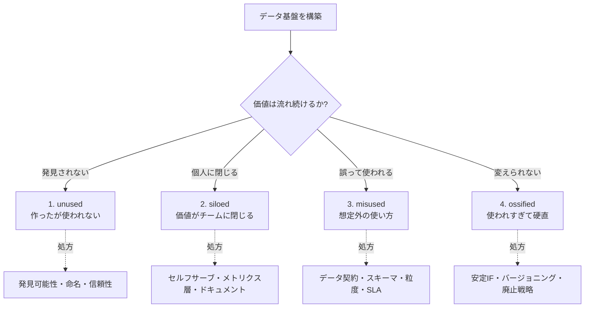

# なぜデータ基盤は腐るのか — 4つの失敗モード

「立派なデータ基盤を作ったのに、半年後には誰も使っていない」「あのテーブル、触ると何が壊れるか分からないから放置されている」——こうした光景は、どんな組織でも起こります。データ基盤は完成した瞬間が劣化の始まりです。コードと違って、データ基盤は使われ方・組織・データそのものが時間とともに変わるため、放っておけば必ず「腐り」ます。

このレッスンは、コース全体の背骨です。データ基盤の腐り方を4つの失敗モードに分解し、それぞれの「症状 → 原因 → 兆候」を見抜けるようにします。そして、後続のどのパートでその病を処方するのかの地図を渡します。

:::insight データ基盤の品質は「動くか」では測れない
バッチが落ちずに動いていても、誰にも使われず、意味を誤解され、変更も廃止もできない基盤は「腐っている」。健全さは技術的正しさではなく、価値が継続的に流れているかで測る。
:::

## 腐敗の全体マップ

まず全体像です。4つの失敗モードと、それぞれを処方するパートの対応を頭に入れてください。



## 失敗モード1: 作ったけど使われない（unused）

**症状**: 鳴り物入りで作った売上ダッシュボードを、3ヶ月後に開くと閲覧数ゼロ。みんな相変わらず手元のスプレッドシートを更新している。

**原因**: 「データがあること」を誰も知らない。あるいは知っていても、信用できない。作り手起点（=作れるものを作った）で、利用者起点（=誰がどの判断のために何を見たいか）ではなかった。命名も `tbl_001_final_v2` のようで、探しても見つからない。

**兆候の見抜き方**: アクセスログがほぼ無い。データの鮮度を聞かれる（=信用されていない）。「あれってどこにあるの?」という質問が定期的に来る。

:::antipattern 「作ってから周知すればいい」
利用者の判断フローに食い込んでいない基盤は、どれだけ周知しても使われない。最初の設計段階で「誰のどの意思決定を置き換えるか」を決めていないと、後から需要は生まれない。
:::

このモードはコース後半の「発見可能性（カタログ・メタデータ）」「命名規約」「信頼性（鮮度・テスト）」のパートで処方します。

## 失敗モード2: 価値がチームに閉じる（siloed）

**症状**: データに詳しい一人だけが複雑なSQLを書き、他チームは毎回その人に依頼する。依頼待ち行列ができ、その人が休むと分析が止まる。

**原因**: 集計ロジックが個人の頭やアドホックなクエリに閉じ込められ、再利用可能な形（共通の指標定義やセルフサーブ環境）になっていない。同じ「売上」を各人が少しずつ違う定義で計算してしまう。

:::example 定義の散らばり
「完了売上」を出すクエリが人によって違う。

```sql
-- Aさん: キャンセルを除外し忘れている
SELECT SUM(oi.quantity * oi.unit_price) AS revenue
FROM orders o
JOIN order_items oi ON o.order_id = oi.order_id;

-- Bさん: 正しく completed のみ
SELECT SUM(oi.quantity * oi.unit_price) AS revenue
FROM orders o
JOIN order_items oi ON o.order_id = oi.order_id
WHERE o.status = 'completed';
```
同じ「売上」という言葉で違う数字が出る。会議で数字が合わず、データへの不信につながる。
:::

**兆候の見抜き方**: 「あの数字、誰に聞けば出る?」が口癖になる。同じ指標の値が資料ごとに食い違う。新メンバーが自力でデータに辿り着けない。

このモードは「セルフサーブ分析」「メトリクス層（指標の一元定義）」「ドキュメント」のパートで処方します。

## 失敗モード3: 想定外の使い方をされる（misused）

**症状**: `orders` テーブルを「全注文の売上」と思い込んで集計したら、実は `pending`（未確定）や `cancelled` も混じっていて、報告した数字が過大だった。

**原因**: テーブルの粒度・カラムの意味・含まれる行の条件が、利用者と提供者の間で合意されていない。`status` の取りうる値や、`fct_orders` の1行が「注文単位」なのか「注文明細単位」なのかが曖昧。データ契約（提供側の約束）が無い。

:::warning 粒度の取り違えは静かに数字を壊す
注文粒度と明細粒度を混同して結合すると、金額が膨らんでもエラーは出ない。「動くが間違っている」が最も危険。1行が何を表すかを、必ず定義として明示する。
:::

```sql
-- 明細粒度の fct_orders を、誤って注文単位だと思い SUM すると
-- 同じ注文が複数行ぶん重複し金額が膨らむ
SELECT customer_key, SUM(amount) AS total
FROM fct_orders
GROUP BY customer_key;  -- amount が「明細ごと」なら正しいが「注文ごと」だと意図次第で破綻
```

**兆候の見抜き方**: 数字の二重計上や桁違いの値。同じテーブルに対する解釈がレビューで毎回割れる。「このカラムって何?」がコードコメントではなくSlackで飛び交う。

このモードは「データ契約」「スキーマ設計」「粒度の明示」「SLA」のパートで処方します。

## 失敗モード4: 使われすぎて変更できない（ossified）

**症状**: あるテーブルのカラム名を直したいが、どこから参照されているか把握できず、触ると何が壊れるか分からないので誰も手を出せない。基盤が「動く化石」になる。

**原因**: 内部実装が安定インターフェースの裏に隠されておらず、利用者が生テーブルに直接依存している。バージョニングも廃止プロセスも無いため、変更=即破壊になる。皮肉にも、よく使われる成功した基盤ほどこの罠に落ちる。

**兆候の見抜き方**: 「このカラム消したいけど影響範囲が読めない」が頻発。誰も古いテーブルを消せず増え続ける。スキーマ変更のたびに各所が壊れる。

:::tip 成功は硬直の入口
unused の逆、つまり「使われている」状態こそ ossified への入口。利用が増える前に、変えてよい部分（内部）と約束する部分（IF）を分離しておく。
:::

このモードは「安定インターフェース」「抽象化（ビュー/メトリクス層）」「バージョニングと廃止戦略」「疎結合・オーナーシップ」のパートで処方します。

## 4モードはつながっている

これらは独立した病ではありません。unused を恐れて使ってもらおうとすると siloed な属人化が起き、急いで共有すると契約不在で misused が起き、定着して成功すると ossified になります。順に通過しうる「ライフサイクル上の罠」だと捉えてください。

### 腐らせないポイント

- **unused**: 利用者の意思決定を起点に設計し、発見可能性（カタログ・命名）と信頼性を最初から組み込む。
- **siloed**: 指標を一元定義し、誰でも自力で辿り着けるセルフサーブ環境とドキュメントを用意する。
- **misused**: 粒度・スキーマ・status の意味をデータ契約として明示し、SLAで約束する。
- **ossified**: 内部実装と安定インターフェースを分離し、バージョニングと廃止戦略を最初から持つ。

## まとめ

- データ基盤は「動くか」ではなく「価値が流れ続けるか」で健全さを測る。完成は劣化の始まり。
- 腐り方は4モード——unused（使われない）/ siloed（閉じる）/ misused（誤用）/ ossified（硬直）。
- 各モードは症状・原因・兆候で見抜ける。アクセスゼロ、数字の食い違い、二重計上、影響範囲不明が代表的なシグナル。
- 4モードは独立せず、ライフサイクル上で順に現れる連続した罠である。
- 本コースは各モードを後続パートで処方する。このマップを羅針盤に読み進めてほしい。
