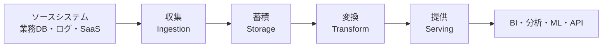
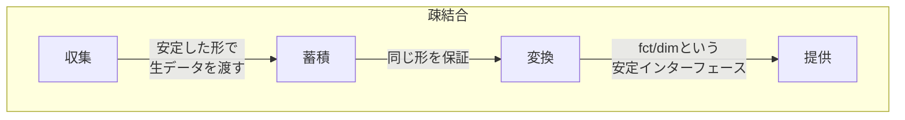

# アーキテクチャ全体像 — 収集・蓄積・変換・提供

データ基盤を初めて設計しようとすると、たいてい「とにかく全部のデータをこのDBに集めて、そこからグラフを作ろう」という一枚岩の発想に行き着く。これは家を建てるのに、台所も寝室も玄関も仕切りのない一部屋でやろうとするのに似ている。最初は早いが、後から「お風呂だけ広げたい」と思っても壁が動かせない。

データ基盤を腐らせないための最初の一歩は、**役割の違う処理を層（レイヤ）に分けて、層と層のあいだに明確な境界を引く**ことだ。このレッスンでは、基盤を貫く4つの層 — 収集・蓄積・変換・提供 — の責務と境界を俯瞰する。

## 全体像を一枚で

データは左から右へ流れる。生データを集め、安全な置き場にため、意味のある形に変え、使い手に届ける。



この4層は「データエンジニアの流儀」というより、ほとんどの現代的データ基盤（データウェアハウス／レイクハウス）が自然と落ち着く構造だ。順に見ていく。

## 各層の責務

### 収集（Ingestion）

ソース（業務DB `customers` や `orders`、アプリのイベントログ、外部SaaS）からデータを取り出し、基盤に運び込む層。責務はただ一つ、**「壊さず・取りこぼさず運ぶ」**こと。ここで集計や加工をしてはいけない。運送業者が荷物の中身を勝手に詰め替えないのと同じだ。

:::tip
収集層では「生のまま（raw）」を保つのが鉄則。`orders.status` が `'pending'` だろうと欠損していようと、判断せずそのまま運ぶ。意味づけは後の層の仕事。
:::

### 蓄積（Storage）

運ばれてきた生データをそのまま貯める層。前レッスンの「データレイク」やウェアハウスの生データ領域がここにあたる。責務は**「いつでも取り出せる、信頼できる単一の置き場であること」**。

ここに `customers` `products` `orders` `order_items` `events` の生コピーが、ソースの構造を保ったまま並ぶ。変換でしくじっても、ここに原本があれば作り直せる。蓄積層は基盤の「セーブポイント」だ。

### 変換（Transform）

生データを、分析しやすい意味のある形に作り替える層。基盤の頭脳であり、ここで一番ロジックが厚くなる。バラバラの生テーブルを結合・集計し、スター・スキーマ（`fct_orders`, `dim_customer`, `dim_product`, `dim_date`）のような完成形に整える。

```sql
-- 変換層: 生のorders/order_itemsから注文粒度のファクトを組み立てる
SELECT
  o.order_id,
  c.customer_key,
  o.order_date,
  SUM(oi.quantity * oi.unit_price) AS amount,
  o.status
FROM raw.orders AS o
JOIN raw.order_items AS oi ON oi.order_id = o.order_id
JOIN marts.dim_customer AS c ON c.customer_id = o.customer_id
WHERE o.status = 'completed'
GROUP BY o.order_id, c.customer_key, o.order_date, o.status;
```

「完了注文だけを対象にする」「金額は `quantity * unit_price` の合計」といったビジネスの約束ごとは、すべてこの層に閉じ込める。

### 提供（Serving）

変換済みのデータを利用者に届ける層。BIダッシュボード、SQLクライアント、機械学習の特徴量、社内API — 出口はさまざまだ。責務は**「使い手が迷わず・安全に・速く使える形で見せること」**。生テーブルではなく、整えられた `fct_orders` や集計ビューを公開窓口にする。

## 境界が効く理由 — 疎結合と変更容易性

なぜわざわざ4つに分けるのか。答えは**「層のあいだに境界があると、片側を変えてももう片側に波及しないから」**だ。

:::insight レイヤ境界 = 変更の防火壁
各層は「隣の層が何を渡してくれるか」だけに依存し、「隣の層がどう作っているか」には依存しない。これが疎結合。境界がインターフェース（契約）として働き、変更の影響を一層の内側に閉じ込める。
:::

具体例で考えよう。ソースの業務DBが MySQL から PostgreSQL に移行したとする。境界がきちんとしていれば、影響を受けるのは**収集層だけ**。蓄積層に届く生データの形が同じなら、変換層も提供層もダッシュボードも、何ひとつ知らなくていい。逆に変換ロジックの「完了注文の定義」を変えたいときは、変換層の中だけを直せばよく、収集や蓄積は触らない。

これが一枚岩だと、ソースDBの変更が集計SQLにもダッシュボードにも直結し、どこまで影響するか誰にも読めなくなる。



:::antipattern
「ダッシュボードのSQLが直接ソースの `orders` テーブルを叩いている」。一見早いが、収集・蓄積・変換を全部すっ飛ばして提供と収集が癒着した状態。ソース側の小さな仕様変更がダッシュボードを即座に壊す。層を貫通したショートカットは、後で必ず利息付きで返ってくる。
:::

### 腐らせないポイント

このレッスンが主に紐づく失敗モードは **4. 使われすぎて変更できない（ossified）**。

基盤は使われるほど依存が増え、依存が増えるほど動かせなくなる。これを防ぐ唯一の現実的な方法が、**層の境界を安定インターフェースとして守る**ことだ。

- 利用者には生テーブルを見せず、変換層が用意した `fct_orders` / `dim_*` だけを提供層の窓口にする。これで内部実装（変換ロジックやソース構造）を自由に作り替えられる余地が残る。
- 層を飛び越える依存（提供から収集への直結など）を作らない。ショートカットは将来の変更を縛る。
- 各層に明確なオーナーを置き、「この境界の形は誰が約束するか」をはっきりさせる。境界の契約を守る責任者がいない基盤は、なし崩しに癒着していく。

疎結合とは「変えられる自由を、あらかじめ設計で確保しておく」ことに他ならない。

## 演習

次の問いに答えてみよう（手を動かす課題と考える課題を1問ずつ）。

**問1（SQL）**: 提供層に出す「国別の完了注文の売上合計」を、変換層の `fct_orders` と `dim_customer` から求めるSQLを書け。生の `orders` には触れないこと。

**問2（設計）**: 「ソースの `products` テーブルに `currency`（通貨）列が増えた」とき、4層のうちどの層から順に影響を検討すべきか。境界がうまく機能している場合、最小でどこまでの修正で済むかを説明せよ。

### 解答例

**問1**:

```sql
SELECT
  dc.country,
  SUM(f.amount) AS total_amount
FROM marts.fct_orders AS f
JOIN marts.dim_customer AS dc ON dc.customer_key = f.customer_key
WHERE f.status = 'completed'
GROUP BY dc.country
ORDER BY total_amount DESC;
```

`fct_orders` は変換層がすでに「完了注文・金額計算済み」で整えているため、提供層のクエリは結合と集計に集中でき、生データのルールを知らなくてよい。

**問2**: まず**収集層**で新しい `currency` 列を取りこぼさず運ぶか確認する。次に**蓄積層**に生のまま保持されるかを見る。`dim_product` に通貨を反映したいなら**変換層**で `dim_product` の定義を更新する。提供層やダッシュボードは、変換層が `dim_product` の安定したインターフェースを保つ限り、通貨を使いたくなるまで一切変更不要。境界が効いていれば、影響は「下流から順に、必要なところで止められる」。

## まとめ

- データ基盤は **収集 → 蓄積 → 変換 → 提供** の4層に流れる。各層は責務が明確に異なる。
- **収集は壊さず運ぶ／蓄積は原本を保つ／変換は意味づけと集計／提供は安全に届ける**。加工ロジックは変換層に閉じ込める。
- 層と層の**境界がインターフェース（契約）**として働き、変更の影響を一層の内側に封じ込める（疎結合）。
- 提供層では生テーブルではなく `fct_orders` / `dim_*` を窓口にし、内部を作り替える自由を残す。
- 層を貫通するショートカットと境界の無責任さが、基盤を「変更できない（ossified）」状態へ腐らせる最大の原因。
