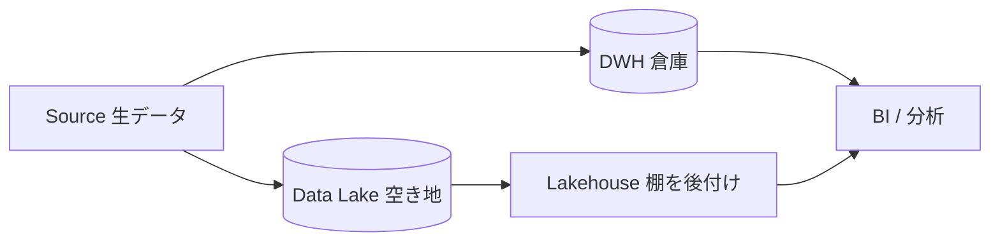

# ストレージ層 — DWH・データレイク・レイクハウス

データ基盤の心臓部は「データをどこに、どんな形で置くか」だ。同じ売上データでも、置き場所を間違えると「集計が遅い」「コストが青天井」「誰も使えない」となり、せっかく作った基盤が誰にも使われなくなる。この回では、ストレージ層の3つの主役 —— DWH・データレイク・レイクハウス —— の違いと使い分け、そして列指向・パーティション・コストという、置き場所選びを左右する3つの感覚を身につける。

## 直感をつかむ：倉庫・空き地・両取り

たとえ話から入ろう。

- **DWH（データウェアハウス）** は「整理された倉庫」。棚が決まっていて(=スキーマが決まっていて)、すぐ取り出せる。ただし入れる前に箱詰め(=整形)が必要。
- **データレイク** は「広い空き地」。とりあえず何でも放り込める(=生データをそのまま置ける)。安いが、欲しい物を探すのは大変。
- **レイクハウス** は「空き地に棚を後付けした両取り」。安く何でも置けるレイクの上に、倉庫のような構造とルールを乗せる。



## 正確な定義

:::insight
DWHは「構造化データを問い合わせ最適化された形で蓄える分析用DB」、データレイクは「あらゆる形式の生データを安価に蓄えるストレージ」、レイクハウスは「レイクの安さ・柔軟さの上にDWHの構造・トランザクション・性能を載せた折衷型」。
:::

| | DWH | データレイク | レイクハウス |
|---|---|---|---|
| 置けるデータ | 構造化中心 | 何でも（ログ/画像/JSON） | 何でも＋表形式 |
| スキーマ | 書き込み時に確定 (schema-on-write) | 読み取り時に解釈 (schema-on-read) | 表は確定、生は柔軟 |
| 速度 | 速い | 遅め | 速い |
| コスト | 高め | 安い | 中 |
| 代表例 | BigQuery / Snowflake / Redshift | S3 / GCS 上のファイル | S3 + Apache Iceberg / Delta Lake |

製品名はあくまで例。重要なのは「いつ構造を決めるか」と「何を優先するか」だ。生データは安く全部レイクに残し、分析が固まったものをDWH/表形式に整える、という併用がいまの主流だ。

## 列指向：なぜ分析は速いのか

分析クエリの大半は「全列のうち数列だけを、大量の行にわたって集計する」。たとえば注文金額の合計を出すとき、`status` や `order_date` は見ても、他の列はいらない。

- **行指向（OLTP向け）**：1行をまとめて保存。1件取得・更新は速いが、1列だけ集計でも全列を読む。
- **列指向（OLAP向け）**：同じ列を連続して保存。必要な列だけ読めばよく、同種の値が並ぶので圧縮も効く。

```sql
-- この集計で実際に読むのは amount と status の2列だけ。
-- 列指向なら他の列のI/Oが発生しない。
SELECT status, SUM(amount) AS total_amount
FROM fct_orders
GROUP BY status;
```

:::tip
「SELECT * は避けて必要な列だけ」と言われるのは行儀の問題ではない。列指向ストレージでは、読む列数がほぼそのままスキャン量＝課金額になる。
:::

## パーティション：読まない部分を読まない

パーティションは、テーブルを「ある列の値ごとに物理的に区切って保存」する仕組み。日付で区切るのが定番だ。区切っておくと、クエリの条件に合わない区画をまるごとスキップ（プルーニング）できる。

```sql
-- order_date でパーティションされていれば、
-- 6月の1区画だけを読み、過去ぶんは一切スキャンされる。
SELECT customer_key, SUM(amount) AS total_amount
FROM fct_orders
WHERE order_date >= DATE '2026-06-01'
  AND order_date <  DATE '2026-07-01'
GROUP BY customer_key;
```

数年ぶんの注文を全部置いても、直近1か月だけを問い合わせれば1か月ぶんしか読まない。これがコストと速度に直結する。

:::warning
パーティション列を WHERE で指定しないと、せっかく区切っても全区画を読んでしまう（フルスキャン）。`WHERE customer_key = 42` のように、区切っていない列だけで絞ってもプルーニングは効かない。
:::

## コスト感：保管より「スキャン」が効く

クラウドのストレージ層では、料金がざっくり2つに分かれる。

- **保管コスト**：置いておくだけでかかる。1TBあたり月数十円〜数ドル程度と、実は安い。
- **スキャン/計算コスト**：クエリのたびに「読んだバイト数」や「使った計算時間」でかかる。ここが効く。

つまり「データを消す」よりも「1回のクエリで読む量を減らす」ほうがコスト削減に効く。列指向（列を絞る）とパーティション（行を絞る）は、まさにこのスキャン量を減らす2大手段だ。

:::antipattern
コスト削減のために生データをこまめに削除する。実際は保管費は安く、削除は「あとで再集計できない」という信頼性の損失のほうが痛い。減らすべきはスキャン量であって、保管量ではないことが多い。
:::

## よくあるアンチパターン

- **何でもレイクに投げっぱなし**：構造もカタログもなく放置され、「データ沼（data swamp）」化。どこに何があるか誰も分からず使われない。
- **全部DWHに高頻度ロード**：生ログまで高価な倉庫に入れ、保管・整形コストが膨張。
- **パーティション無しの巨大テーブル**：毎回フルスキャンで遅く・高い。

### 腐らせないポイント

このレッスンは失敗モード1「作ったけど使われない（unused）」に直結する。置き場所の設計を誤ると、こう腐る。

- **遅い・高いから使われない**：列指向を活かさないSELECT *、パーティション未設計のフルスキャンは、利用者を「重くて使えない」と離れさせる。利用者起点で「直近データを速く返す」設計にする。
- **見つからないから使われない**：レイクに無秩序に置かれた生データは、命名・カタログ・構造が無ければ発見できない。レイクハウスのように「安く全部残す」と「構造を与える」を両立させ、発見可能性と信頼性を確保する。

置き場所選びは「どれが偉いか」ではなく「生は安く全部残し、よく使う形だけ速く整える」という役割分担だと捉えるとよい。

## 演習

共通スキーマの `fct_orders` を使う。次の2つに答えよ。

1. 「2026年に完了した注文の総額」を、スキャン量を最小化する形で書け（`fct_orders` は `order_date` でパーティション、`status` を持つ）。
2. 1のクエリが列指向＋パーティションでなぜ安くなるか、1文で説明せよ。

### 解答例

```sql
-- 1
SELECT SUM(amount) AS total_amount
FROM fct_orders
WHERE order_date >= DATE '2026-01-01'
  AND order_date <  DATE '2027-01-01'
  AND status = 'completed';
```

2. パーティション列 `order_date` で2026年の区画だけにスキャンを絞り（行を削減）、列指向ゆえに参照する `amount`・`order_date`・`status` の列だけを読む（列を削減）ため、読み取りバイト数＝課金額が最小になるから。

## まとめ

- DWH＝整理された倉庫（速い・高い）、レイク＝空き地（安い・柔軟）、レイクハウス＝両取り。「いつ構造を決めるか」で性格が変わる。
- 実務は併用が基本：生データは安くレイクに全部残し、よく使う形だけDWH/表形式に速く整える。
- 列指向は「必要な列だけ読む」ことで分析を速く・安くする。SELECT * を避ける理由はここにある。
- パーティション（多くは日付）は「読まない区画をスキップ」し、スキャン量を激減させる。WHEREでパーティション列を指定するのが鍵。
- クラウドのコストは保管より「スキャン量」が効く。削るべきは保管量でなく1クエリの読み取り量。これを怠ると「遅い・高い・見つからない」で基盤が使われなくなる。
