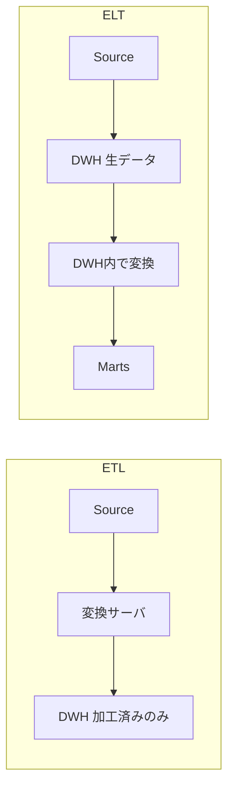
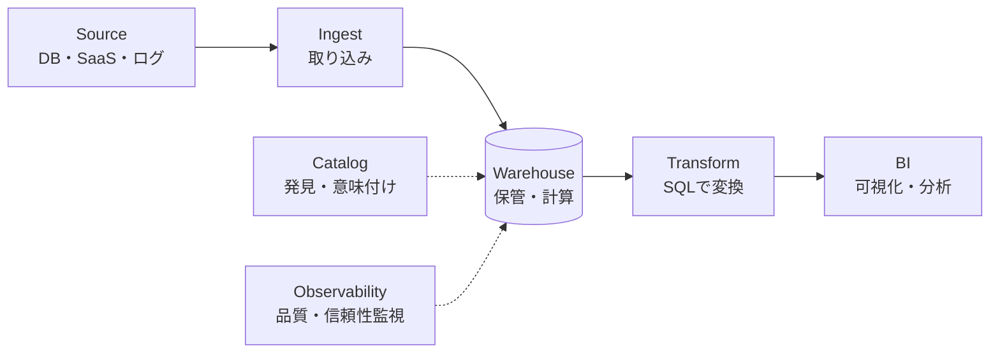

# ETL vs ELT と現代データスタック

データをそのまま使えることはまずない。バラバラな形で生まれた生データを、分析に耐える形へ「整える」工程が必ず要る。この整える順番をめぐる二つの流派が ETL と ELT だ。この章では両者の違い、なぜいま ELT が主流になったのか、そして ELT を支える「現代データスタック」の全体像を俯瞰する。

## 直感をつかむ比喩

引っ越しを思い浮かべてほしい。

ETL は「家具を運ぶ前に、新居の間取りに合わせて全部組み立て直してから運び込む」やり方だ。トラック（処理サーバ）の上で加工し、完成品だけを新居（保管先）に入れる。ELT は「とりあえず全部新居に運び込んでから、広い新居の中でゆっくり組み立てる」やり方。新居（データウェアハウス）が十分に広くて作業台も強力なら、こちらのほうが速くて柔軟だ。

## 正確な定義

ETL と ELT は、データを動かす3つの工程の**順番**が違う。

- **Extract（抽出）**: ソース（DB・SaaS・ログ）から生データを取り出す。
- **Transform（変換）**: クレンジング・結合・集計など、使える形に整える。
- **Load（ロード）**: 保管先に書き込む。

| | ETL | ELT |
|---|---|---|
| 順番 | Extract → Transform → Load | Extract → Load → Transform |
| 変換する場所 | 専用の処理サーバ／中間基盤 | データウェアハウス内部 |
| 保管されるもの | 加工済みデータのみ | 生データ＋加工後データ |
| 主な時代 | オンプレ・処理が高価だった時代 | クラウドDWHが安く強力になった時代 |

:::insight
ETL と ELT の本質的な違いは「変換をどこでやるか」だ。ETL は外で変換してから入れる。ELT はまず全部入れてから、保管先の中で変換する。
:::

## なぜ ELT が主流になったのか



理由は大きく3つある。

1. **ストレージが安くなった**。生データを丸ごと保管しても費用が問題になりにくい。「とりあえず全部入れる」が現実的になった。
2. **DWH の計算力が上がった**。BigQuery や Snowflake は巨大データの変換を SQL で高速に処理できる。専用の変換サーバを別に持つ必要が薄れた。
3. **生データを残せる価値**。加工後だけを保管する ETL では、後から「やっぱり別の切り口で見たい」となったときに元データがない。ELT は生データが残るので、新しい問いに何度でも変換し直せる。

:::tip
ELT の「生データを残す」性質は、要件が変わり続ける分析の現場と相性が良い。最初に変換ロジックを完璧に決めきれなくても、後から作り直せる。
:::

## 現代データスタック（Modern Data Stack）の俯瞰

ELT を前提に、各工程を専門ツールが分担する構成が現代データスタックだ。データが流れる順に6つの層を押さえよう。



- **Ingest（取り込み）**: ソースから生データを DWH へ運ぶ（Extract + Load）。SaaS のデータをコネクタ経由で同期するイメージ。
- **Warehouse（ウェアハウス）**: 生データと加工後データを保管し、変換の計算も担う中心地。スタックの心臓部。
- **Transform（変換）**: DWH の中で SQL を使い、生データから分析用テーブル（marts）を組み立てる。staging → marts の段階的な整形。
- **BI（可視化・分析）**: 整ったデータをダッシュボードやレポートにして、意思決定に使う。
- **Catalog（カタログ）**: どんなデータがどこにあり、何を意味するかの目録。「あのテーブル、誰のもの？定義は？」に答える。
- **Observability（オブザーバビリティ）**: データが遅延していないか、件数が急減していないか、おかしな値が混じっていないかを監視し、信頼性を保つ。

最初の Ingest が生データをこう運び込む（共通スキーマの `orders` をそのまま DWH へ）。

```sql
-- Ingest 後、DWH に届いた生データ（raw）はソースの形のまま
SELECT order_id, customer_id, order_date, status
FROM raw.orders
WHERE status = 'completed';
```

次に Transform 層が、この生データを分析用のファクトテーブルへ整える。

```sql
-- Transform: 生の order_items から注文金額を集計し marts を組み立てる
SELECT
  oi.order_id,
  SUM(oi.quantity * oi.unit_price) AS amount
FROM raw.order_items AS oi
GROUP BY oi.order_id;
```

この `amount` が `fct_orders` の列になり、BI 層のダッシュボードで売上として表示される。生データ（raw）はそのまま残るので、後から別の集計を作りたくなっても元に戻れる。

## よくあるアンチパターン

:::antipattern
**全部を一つの巨大スクリプトで抱え込む。** 取り込みも変換も可視化も自前の一枚岩スクリプトに詰め込むと、作った本人しか触れなくなる。各層を専門ツールに分けるのは、責務を分離して他の人も参加できるようにするためでもある。
:::

:::warning
**Catalog と Observability を「後回しの飾り」と考える。** この2層がないと、データはあっても「誰も意味を知らない」「壊れても気づけない」状態になり、結局使われなくなる。スタックの一部として最初から組み込む。
:::

## 腐らせないポイント

このレッスンは失敗モード **2: 価値がチームに閉じる（siloed）** に直結する。

現代データスタックの最大の狙いは「特定の誰かにしか分からない基盤」をなくすことだ。

- **層を分けて専門ツールに任せる** ことで、一人が全部を抱え込む属人化を防ぐ。各層に担当（オーナー）を置けるようになる。
- **Catalog** は、データの意味と所在をチーム全員に開く。新メンバーが「どのテーブルを使えばいいか」を自力で探せる＝セルフサーブの土台になる。
- **Transform を SQL で透明に書く** ことで、変換ロジックがブラックボックスにならず、他の人がレビュー・再利用できる。

逆にこれらを欠くと、基盤は「作った人だけのもの」になり、その人が抜けた瞬間に誰も使えなくなる。スタックを層に分けることは、技術的な都合以上に「価値をチームに開く」ための設計判断だ。

## 演習

共通スキーマを使って考えてみよう。

問: ELT の方針に従い、`raw.orders` と `raw.order_items` の生データから、注文ごとの合計金額（completed のみ）を求める Transform 層のクエリを書け。これは将来 `fct_orders` の元になる。

解答例:

```sql
SELECT
  o.order_id,
  SUM(oi.quantity * oi.unit_price) AS amount
FROM raw.orders AS o
JOIN raw.order_items AS oi
  ON o.order_id = oi.order_id
WHERE o.status = 'completed'
GROUP BY o.order_id;
```

生データ（raw）を残したまま、その上に変換層を重ねている点が ELT の発想だ。後から「キャンセル分も含めたい」となれば、WHERE を変えて作り直すだけでよい。

## まとめ

- ETL と ELT の違いは「変換をどこでやるか」。ETL は外で変換してから入れ、ELT はまず入れてから DWH 内で変換する。
- クラウド DWH の低コスト化・高性能化と「生データを残せる」価値により、いまは ELT が主流。
- 現代データスタックは Ingest / Warehouse / Transform / BI / Catalog / Observability の6層を専門ツールで分担する。
- 層を分けることは属人化を防ぎ、Catalog や透明な SQL 変換は価値をチームに開く（siloed への対策）。
- Catalog と Observability は飾りではなく、信頼して使われ続ける基盤の必須要素。
