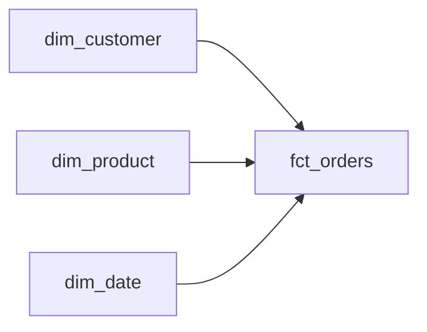

# データモデリング入門 — 正規化と非正規化

データを「どう並べて保存するか」を決めるのがデータモデリングです。同じ情報でも、テーブルの分け方ひとつで更新のしやすさも分析の速さも大きく変わります。このレッスンでは、まず整理整頓の原則である**正規化**を直感でつかみ、次に分析の現場でわざと崩す**非正規化**のトレードオフを学びます。最後に、すべての土台になる**粒度(grain)**という考え方を導入します。

## 正規化を直感でつかむ

正規化とは「同じ事実を一箇所にだけ書く」ための整理術です。コピーが散らばっていると、片方だけ直し忘れて矛盾が生まれる。これを防ぐのが目的です。

:::insight 一事実一箇所
正規化の核心は「One fact in one place」。事実が一箇所にしかなければ、更新も一箇所で済み、矛盾しようがない。
:::

段階的に見ていきましょう。崩れた状態の注文テーブルを例にします。

```sql
-- 悪い例: 1行に複数商品を詰め込み、顧客名や価格を重複保持
-- order_id | customer_name | items                       | country
-- 1001     | Sato          | "Pen x2; Notebook x1"       | JP
-- 1002     | Sato          | "Pen x3"                    | JP
```

ここには3つの問題が潜んでいます。

- **1NF（第一正規形）違反**: `items` に複数値を詰め込んでいる。1セル1値にする。
- **2NF（第二正規形）違反**: 商品の単価が主キーの一部にしか依存しない（部分関数従属）。
- **3NF（第三正規形）違反**: `country` が `customer_name` に依存している（推移的関数従属）。顧客の属性が注文側に紛れ込んでいる。

これを共通スキーマの形に整えると、事実ごとにテーブルが分かれます。

```sql
-- customers: 顧客の事実だけ
SELECT customer_id, name, country, signup_date FROM customers;

-- orders: 注文ヘッダの事実だけ（1注文1行）
SELECT order_id, customer_id, order_date, status FROM orders;

-- order_items: 明細の事実だけ（1商品1行、数量と価格を保持）
SELECT order_item_id, order_id, product_id, quantity, unit_price FROM order_items;

-- products: 商品マスタの事実だけ
SELECT product_id, name, category, price FROM products;
```

| 正規形 | 一言で | 解消する問題 |
|--------|--------|--------------|
| 1NF | 1セルに1値、繰り返しグループを排除 | 多値の混在 |
| 2NF | 主キー全体に依存させる | 部分従属による重複 |
| 3NF | キー以外への依存を排除 | 推移従属による重複 |

正規化された形は**書き込みに強い**。価格を直すなら `products` の1行を更新すれば、すべての注文に一貫して反映されます。

## 非正規化とそのトレードオフ

ところが分析の現場では、この正しく分かれた形が**読み取りに弱い**ことがあります。「商品カテゴリ別の売上」を出すだけで、4テーブルを結合する必要が出てきます。

```sql
-- 正規化された形での集計: JOINが連鎖する
SELECT p.category, SUM(oi.quantity * oi.unit_price) AS revenue
FROM order_items oi
JOIN orders o    ON oi.order_id = o.order_id
JOIN products p  ON oi.product_id = p.product_id
WHERE o.status = 'completed'
GROUP BY p.category;
```

**非正規化**は、この結合をあらかじめ済ませて1枚のテーブルに展開しておく考え方です。読み取りのために、あえて重複を許します。

```sql
-- 非正規化したワイドテーブル（分析用に事前結合）
-- order_item_id | order_date | customer_country | product_category | amount | status
-- 9001          | 2024-05-01 | JP               | stationery       | 200    | completed
```

集計はこの1枚で完結します。

```sql
SELECT product_category, SUM(amount) AS revenue
FROM denorm_order_items
WHERE status = 'completed'
GROUP BY product_category;
```

トレードオフは明確です。

| 観点 | 正規化 | 非正規化 |
|------|--------|----------|
| 書き込み | 速い・矛盾しにくい | 重複更新が必要・矛盾リスク |
| 読み取り | JOIN多く遅い | 1テーブルで速い |
| 容量 | 小さい | 大きい |
| 向く用途 | OLTP（業務システム） | OLAP（分析） |

:::tip OLTPとOLAP
業務システム(OLTP)は「正しく速く書く」ことが最優先なので正規化。分析基盤(OLAP)は「大量に速く読む」ことが最優先なので非正規化が効く。目的が真逆だから設計も逆になる。
:::

## なぜ分析では非正規化が効くのか

理由は3つです。

1. **JOINコストの排除**: 列指向の分析DB（BigQuery等）では、結合より単一テーブルのスキャンが圧倒的に速い。
2. **意味の固定**: 「`completed` の注文だけ」「税込み」といった定義を事前計算で焼き付けられ、利用者ごとの解釈ブレを防げる。
3. **セルフサーブ**: 非エンジニアでも1テーブルにSQLを投げるだけで答えにたどり着ける。

そして分析モデルの定番が、共通スキーマにある**スター・スキーマ**です。中心の事実表(fact)を、複数の次元表(dimension)が囲みます。



完全な1枚ではなく、事実と次元を程よく分ける。重複を抑えつつ結合も最小限という、正規化と非正規化の中間に位置する実用的な落とし所です。

## 粒度(grain)— 設計の出発点

非正規化やスター・スキーマを作るとき、最初に決めるべきは**粒度(grain)＝「1行が何を表すか」**です。

:::warning 粒度を曖昧にしない
粒度が決まっていないテーブルは、必ず誤集計を生む。「1行＝1注文」なのに明細単位で金額が入っていれば、SUMは膨らむ。設計の最初の一文は必ず「この表の1行は◯◯を表す」であるべき。
:::

共通スキーマの `fct_orders` は粒度を都度明示します。

- **注文ヘッダ粒度**: 1行＝1注文。`amount` は注文合計。
- **明細粒度**: 1行＝注文内の1商品。`amount` は明細金額。

```sql
-- 注文ヘッダ粒度の事実表（1行 = 1注文）
SELECT
  o.order_id,
  c.customer_key,
  o.order_date AS order_date_key,
  SUM(oi.quantity * oi.unit_price) AS amount,
  o.status
FROM orders o
JOIN order_items oi  ON o.order_id = oi.order_id
JOIN dim_customer c  ON o.customer_id = c.customer_id
GROUP BY o.order_id, c.customer_key, o.order_date, o.status;
```

粒度が揃っていれば、メジャー（合計可能な数値）の足し算は常に正しく、利用者の想定どおりに振る舞います。

## よくあるアンチパターン

:::antipattern 全部入りの一枚岩テーブル
「とりあえず全カラムを1枚に」は一見便利だが、粒度が混在しやすい（注文と明細が同居）。SUMが二重計上になり、誰も信頼しなくなる。非正規化は「粒度を1つに固定したうえで」行う。
:::

:::antipattern 業務DBをそのまま分析に使う
正規化されたOLTPスキーマに分析クエリを投げ続けると、巨大JOINで遅く、定義も人によってバラバラに。分析には目的に合わせたモデル（marts）を別に用意する。
:::

### 腐らせないポイント

このレッスンは失敗モード **「想定外の使い方をされる(misused)」** に直結します。粒度を明示せず、定義を焼き付けないテーブルは、利用者が思い思いに解釈し、誤った数字を量産します。これを防ぐ実践は次のとおりです。

- テーブル定義の冒頭に必ず「1行＝◯◯」と粒度を書く。
- メジャーの意味（税込み/税抜き、対象ステータス）を事前計算で固定し、ドキュメント化する。
- 粒度の異なる事実は同じ表に混ぜず、別の事実表に分ける。

明確な粒度と固定された定義こそが、テーブルの「正しい使い方」を契約として伝える最初の一歩です。

## 演習

**問1**: 共通スキーマの `orders` と `order_items` を結合し、**注文ヘッダ粒度（1行＝1注文）**で、注文ごとの合計金額を求めるSQLを書いてください（`completed` のみ対象）。

**問2**: 同じデータを**明細粒度（1行＝1商品）**で表すと、1注文が複数行になります。このとき問1の合計を `order_items` から直接 `SUM` する場合との違いを一言で説明してください。

```sql
-- 解答1: 注文ヘッダ粒度
SELECT
  o.order_id,
  SUM(oi.quantity * oi.unit_price) AS order_amount
FROM orders o
JOIN order_items oi ON o.order_id = oi.order_id
WHERE o.status = 'completed'
GROUP BY o.order_id;
```

解答2: 明細粒度では1注文が複数行に分かれるため、`GROUP BY order_id` で集約しないと注文単位の合計にならない。粒度が変われば、同じ「合計」でも `GROUP BY` の指定と1行の意味が変わる。だから「この表の1行は何か」を先に決めることが不可欠。

## まとめ

- 正規化は「一事実一箇所」。1NF→2NF→3NFと重複・依存を排除し、**書き込みに強い**形を作る。
- 非正規化は重複を許して**読み取りを速くする**。OLTPは正規化、OLAP（分析）は非正規化が基本。
- 分析の定番はスター・スキーマ。事実表と次元表で、結合最小と重複抑制を両立する。
- すべての設計は**粒度(grain)＝「1行が何を表すか」**から始まる。粒度の明示が誤集計を防ぐ。
- 粒度と定義を固定・ドキュメント化することが、misused（想定外の使い方）を防ぐ最大の防御になる。
