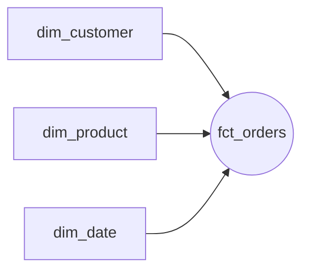
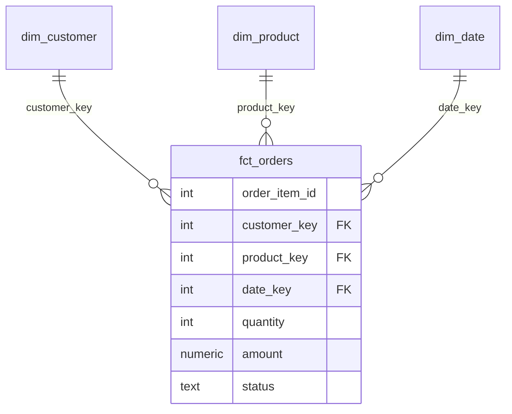

# 次元モデリングとスタースキーマ

注文データを「速く・分かりやすく・壊れにくく」分析したい。そのための定番の設計図が **次元モデリング（dimensional modeling）** であり、その代表形が **スタースキーマ** です。生のテーブルをそのまま分析に使うと、JOINが複雑になり、定義がブレ、いつの間にか誰も触れない代物になります。このレッスンでは、腐らない分析テーブルの骨格を手を動かして組み立てます。

## 直感：事実と、その文脈

レストランの伝票を思い浮かべてください。「2024年6月13日、田中さんが、パスタを2皿、1,200円で買った」。この文の中で、

- **測りたい数値**（2皿、1,200円）= **ファクト（fact, 事実）**
- **その数値を説明する文脈**（いつ・誰が・何を）= **ディメンション（dimension, 次元）**

数値を中心に置き、文脈を周りに放射状に並べる。中心の事実テーブルから次元テーブルへ線を引くと、星のように見える。これが **スタースキーマ** です。



## 正確な定義

- **ファクトテーブル（fact table）**: 業務イベントの測定値（メジャー）と、次元への外部キーだけを持つ。行数が多く、縦に伸びる。例: `fct_orders`。
- **ディメンションテーブル（dimension table）**: 「誰・何・いつ・どこ」を説明する属性の集合。行数は少なく、横に広い。例: `dim_customer`, `dim_product`, `dim_date`。

:::insight
ファクトは「動詞（起きたこと）」、ディメンションは「名詞（その登場人物）」。分析の問いは必ず「ディメンションで切って、ファクトを集計する」形になる。だからこの2つを分けて設計すると、問いがそのままSQLになる。
:::

## 粒度（grain）を最初に宣言する

設計で最初にやるべきは、ファクト1行が **何を表すか** をはっきり決めることです。これを **粒度（grain）** と呼びます。

- 「注文1件 = 1行」なのか
- 「注文明細1行 = 1行」なのか

この2つは別物です。同じ `fct_orders` でも粒度が混ざると、金額が二重計上されたり、集計が合わなくなります。

:::warning
粒度を口頭の暗黙了解にしてはいけない。「このテーブルは注文明細粒度」とテーブル定義・ドキュメントに明記する。粒度の宣言は、後述する「想定外の使われ方（misused）」を防ぐ最重要の防波堤。
:::

このレッスンでは **注文明細（order_item）粒度** で `fct_orders` を作ります。1行 = 商品1種類分の購入。

## サロゲートキー（surrogate key）

ディメンションには、業務上のID（`customer_id` など、これを **ナチュラルキー** と呼ぶ）とは別に、基盤内部だけで使う連番のキーを与えます。これが **サロゲートキー（代理キー）**、例えば `customer_key` です。

なぜ分けるのか。

- 業務IDの体系が将来変わっても、基盤内部の結合は壊れない（疎結合）。
- 後述のSCD Type2で「同じ顧客の履歴版」を複数行持つとき、行ごとに一意なキーが必要になる。

:::tip
ファクトはナチュラルキーではなく **サロゲートキーで** ディメンションと結合する。これで業務側の都合と分析基盤の都合を切り離せる。
:::

## ディメンションを組み立てる

まず連番のサロゲートキーを振ってディメンションを作ります。

```sql
-- 顧客ディメンション
create table dim_customer as
select
  row_number() over (order by customer_id) as customer_key,  -- サロゲートキー
  customer_id,                                                -- ナチュラルキー
  name,
  country,
  signup_date
from customers;

-- 商品ディメンション
create table dim_product as
select
  row_number() over (order by product_id) as product_key,
  product_id,
  name,
  category,
  price
from products;
```

`dim_date` は注文日を1日1行に展開した暦テーブルです（年・月・曜日などで切れるようにしておく）。

## ファクトを組み立てる

注文明細粒度で、各次元のサロゲートキーと測定値（金額・数量）を持たせます。

```sql
create table fct_orders as
select
  oi.order_item_id,
  dc.customer_key,
  dp.product_key,
  dd.date_key,
  oi.quantity,
  oi.quantity * oi.unit_price as amount,  -- メジャー（明細金額）
  o.status
from order_items oi
join orders     o  on oi.order_id    = o.order_id
join dim_customer dc on o.customer_id  = dc.customer_id
join dim_product  dp on oi.product_id  = dp.product_id
join dim_date     dd on o.order_date   = dd.date;
```

これで「国別×カテゴリ別の売上」のような問いが、素直なJOIN+GROUP BYになります。

```sql
select dc.country, dp.category, sum(f.amount) as revenue
from fct_orders f
join dim_customer dc on f.customer_key = dc.customer_key
join dim_product  dp on f.product_key  = dp.product_key
where f.status = 'completed'
group by dc.country, dp.category;
```



## SCD：ディメンションの「変化」をどう残すか

顧客の `country` が引っ越しで変わったらどうしますか。次元の属性が時間とともに変わる現象を **SCD（Slowly Changing Dimension, 緩やかに変化する次元）** と呼びます。代表的な扱いが2つあります。

- **Type 1（上書き）**: 古い値を捨て、最新で上書きする。履歴は残らない。シンプルだが「過去はどうだったか」は答えられない。
- **Type 2（履歴保持）**: 変更のたびに新しい行を追加し、有効期間（`valid_from`/`valid_to`）と現在フラグ（`is_current`）を持つ。過去の事実を当時の文脈で集計できる。

```sql
-- SCD Type2 のディメンション形（同じ customer_id が複数行を持つ）
-- customer_key | customer_id | country | valid_from | valid_to   | is_current
--      101      |    C001     |  JP     | 2023-01-01 | 2024-05-31 |  false
--      205      |    C001     |  US     | 2024-06-01 | 9999-12-31 |  true
```

:::insight
ファクトは「そのイベントが起きた時点で有効だった行のサロゲートキー」を持つ。だから2024年5月の注文は当時の `JP` 行（key=101）に、6月の注文は `US` 行（key=205）に紐づく。これがサロゲートキーを分けた本当のご褒美。
:::

:::antipattern
「とりあえず全部上書き（Type1）」にして、後から「過去時点の地域別売上を出して」と言われ作り直す——よくある手戻り。履歴が要るか要らないかは設計時にオーナーと合意する。安易なType1は変更不能（ossified）への入口。
:::

## 腐らせないポイント

スタースキーマは、3番（misused）と4番（ossified）の失敗モードに効きます。

- **misused（想定外の使い方）への対策**: 粒度を宣言し、メジャーとディメンションを物理的に分離することで、「この数値を何で切ってよいか」が構造から自明になる。定義のブレや二重計上を設計段階で封じる。
- **ossified（変更できない）への対策**: サロゲートキーで業務IDと内部結合を疎結合にし、SCD Type2で「過去を壊さず変化を追加する」運用にする。属性の変更が既存の集計やダウンストリームを破壊しないため、安全に育て続けられる。

## 演習

問1: 上の `fct_orders` を使い、商品カテゴリ別の総販売数量（quantity合計）を、多い順に出してください（`status='completed'` のみ）。

問2: `dim_customer` がSCD Type2（`is_current` 列あり）だとして、「現在の」顧客属性だけで国別売上を出すには、結合にどんな条件を足すべきか述べてください。

解答例:

```sql
-- 問1
select dp.category, sum(f.quantity) as total_qty
from fct_orders f
join dim_product dp on f.product_key = dp.product_key
where f.status = 'completed'
group by dp.category
order by total_qty desc;
```

問2: ファクトは「注文当時の」サロゲートキーで結合する。最新属性で見たい場合は、ナチュラルキー（`customer_id`）経由で `is_current = true` の行に結合し直すか、別途「現在版だけのビュー」を用意する。注文時点の文脈で見たいなら、ファクトが持つ `customer_key` のまま結合すればよい。

## まとめ

- ファクト=測りたい数値、ディメンション=その文脈。スタースキーマは数値を中心に文脈を放射状に並べた形。
- 設計の第一歩は **粒度の宣言**。1行が何を表すかを明記し、二重計上と誤用を防ぐ。
- ディメンションには **サロゲートキー** を振り、業務IDと内部結合を疎結合に保つ。
- 属性の変化は **SCD** で扱う。Type1は上書き（履歴なし）、Type2は履歴行を追加（過去を壊さない）。
- 粒度宣言とサロゲートキー＋SCDが、misused（誤用）とossified（変更不能）を同時に防ぐ。
