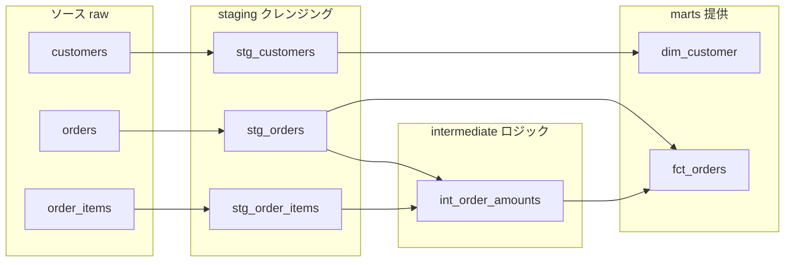

# レイヤリング設計 — staging / intermediate / marts

データ基盤を「ソースから1本のSQLでダッシュボードに直結」させると、最初は速い。だが半年後、同じ「売上」の計算が10箇所にコピペされ、誰も触れなくなる。これを防ぐのが**レイヤリング（層分け）**だ。料理に例えるなら、買ってきた食材をいきなり皿に盛るのではなく、「下ごしらえ → 調理 → 盛り付け」と工程を分ける。各工程に役割を与えることで、変更が局所で済むようになる。

## 直感をつかむ — なぜ層が変更容易性を生むのか

ソースのテーブルは、あなたの都合では変わらない。`orders.status` の値が増えたり、列名が変わったりする。一方、ダッシュボードを見るビジネス側も、欲しい指標を頻繁に変える。**この2つの変化を1枚のSQLで受け止めると、どちらが変わっても全部書き直しになる。**

層を挟むと、変化を**吸収する場所**が決まる。ソースが変わったら一番下の層だけ直す。指標が変わったら一番上の層だけ直す。間の依存は安定インターフェース越しに保たれる。これが層分けの本質だ。



## 三層の正確な定義

:::insight
staging は「ソースを信頼できる形に整える」、intermediate は「ビジネスロジックを組み立てる」、marts は「利用者に提供する」。各層は隣の層しか参照しない（飛び越えない）。
:::

| 層 | 役割 | やること | やらないこと |
|----|------|----------|--------------|
| staging | クレンジング | 列名統一・型変換・NULL処理・1ソース1モデル | 結合・集計・ビジネスロジック |
| intermediate | ロジック | 結合・集計・複雑な計算の中間生成 | 利用者向けの命名・最終提供 |
| marts | 提供 | スター・スキーマ・指標の確定・ドキュメント | 生データへの直接参照 |

### staging — ソースの「方言」を標準語に直す

staging は**ソース1テーブルにつき1モデル**が原則。リネームと型変換だけに徹し、結合や集計はしない。ここで「方言」を吸収しておくと、上の層はソースの事情を知らずに済む。

```sql
-- stg_orders: 列名・型・値の標準化のみ
select
  order_id,
  customer_id,
  cast(order_date as date)            as order_date,
  lower(status)                       as order_status  -- 値の表記ゆれを統一
from raw.orders
where status is not null
```

### intermediate — 再利用するロジックをまとめる

「明細から注文金額を出す」ような、複数のmartsで使い回す計算はここに置く。利用者には見せない中間成果物だ。

```sql
-- int_order_amounts: 明細を注文粒度に集計
select
  oi.order_id,
  sum(oi.quantity * oi.unit_price) as order_amount
from stg_order_items as oi
group by oi.order_id
```

### marts — 利用者が安心して使える完成品

marts は最終提供層。共通スキーマのスター・スキーマがここに来る。粒度・指標の定義を確定し、これを**安定インターフェース**として公開する。

```sql
-- fct_orders: 注文粒度のファクト（提供する完成形）
select
  o.order_id,
  o.customer_id      as customer_key,
  o.order_date       as order_date_key,
  a.order_amount     as amount,
  o.order_status     as status
from stg_orders as o
left join int_order_amounts as a using (order_id)
where o.order_status = 'completed'
```

## メダリオン（bronze/silver/gold）との対応

Databricksなどで使う**メダリオン・アーキテクチャ**も、思想は同じ「下ごしらえ → 調理 → 盛り付け」だ。呼び名が違うだけと捉えてよい。

| メダリオン | 役割 | 三層との対応 |
|------------|------|--------------|
| bronze | 生データの取り込み | ソース raw（層の手前） |
| silver | クレンジング・結合 | staging + intermediate |
| gold | ビジネス向け提供 | marts |

:::tip
チームでどちらの語彙を使うか1つに統一すること。「silverってstagingのこと？intermediateも？」という会話が起きる時点で、命名が腐り始めている。
:::

## 命名規約 — プレフィックスで層を一目でわかるように

層はファイル名・テーブル名の**プレフィックス**で表現する。名前を見ただけで、それがどの層で、何を参照してよいかが分かる。

- `stg_<ソース名>` — staging（例: `stg_orders`）
- `int_<動詞や対象>` — intermediate（例: `int_order_amounts`）
- `fct_<対象>` / `dim_<対象>` — marts のファクト/ディメンション（例: `fct_orders`, `dim_customer`）

:::warning
プレフィックスは規約であって、強制力はない。`fct_orders` が裏で `raw.orders` を直接参照していたら、名前は嘘をついている。命名と実際の依存を一致させ続けることがオーナーの責任だ。
:::

## よくあるアンチパターン

:::antipattern
**staging で集計してしまう。** 「ついでに」と stg_orders で売上を合計すると、staging が1ソース1モデルでなくなり、再利用が効かなくなる。集計は intermediate 以降に置く。
:::

:::antipattern
**marts がソースを直接参照する。** 層を飛び越えると、ソースの変更が marts を直撃する。せっかくの staging が吸収材として機能しない。依存は必ず隣の層へ。
:::

## 腐らせないポイント

層分けは「作ったけど使われない（失敗モード1）」と「使われすぎて変更できない（失敗モード4）」の両方に効く。

- **失敗モード1（unused）への対応**: marts に提供層を明確に置くことで、利用者は「どこを見ればいいか」が一目で分かる。生データの海から正しいテーブルを探す必要がなくなり、発見可能性と信頼性が上がる。
- **失敗モード4（ossified）への対応**: 変化を吸収する場所を層ごとに分けることで、ソース変更は staging に、指標変更は marts に局所化できる。marts を安定インターフェースとして公開すれば、内部の intermediate を自由にリファクタしても利用者には影響しない。疎結合が変更容易性を生む。

## 演習

**問1**: `stg_customers` を staging の原則（1ソース1モデル・リネームと型変換のみ）に従って書け。ソースは `raw.customers(customer_id, name, country, signup_date)`。`signup_date` は文字列で入っているとする。

**問2**: 顧客ごとの完了注文の合計金額を出す intermediate モデル `int_customer_revenue` を書け（`stg_orders` と `int_order_amounts` を使う）。

### 解答例

```sql
-- 問1: stg_customers
select
  customer_id,
  name,
  country,
  cast(signup_date as date) as signup_date
from raw.customers

-- 問2: int_customer_revenue
select
  o.customer_id,
  sum(a.order_amount) as customer_revenue
from stg_orders as o
join int_order_amounts as a using (order_id)
where o.order_status = 'completed'
group by o.customer_id
```

## まとめ

- レイヤリングは「下ごしらえ(staging) → 調理(intermediate) → 盛り付け(marts)」の3工程。各層に1つの役割を与える。
- staging は1ソース1モデルでクレンジングのみ、intermediate は再利用するロジック、marts は安定インターフェースとして提供する。
- メダリオン(bronze/silver/gold)は同じ思想の別名。チームで語彙を1つに統一する。
- 命名プレフィックス(`stg_`/`int_`/`fct_`/`dim_`)で層と依存ルールを一目で示す。名前と実際の依存を一致させ続ける。
- 変化の吸収場所を層ごとに分けることで、ソース変更も指標変更も局所で済み、変更容易性（腐りにくさ）が生まれる。
