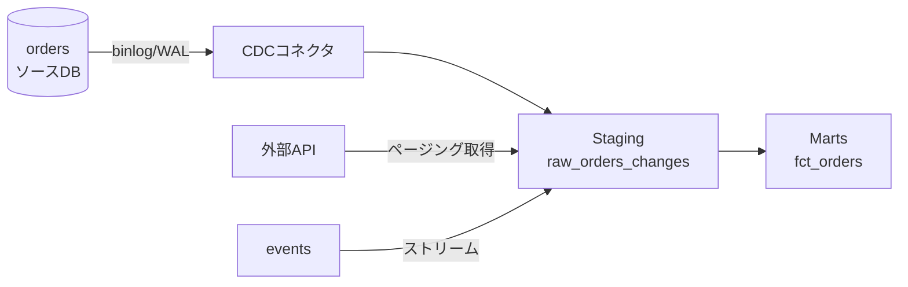

# データ収集 — バッチ・ストリーム・CDC

データ基盤の最初の一歩は「外の世界からデータを運び込む」こと。この入口の設計を誤ると、後段のどんなに美しい変換も土台ごと崩れる。ここでは取り込み（ingestion）の主要な選択肢と、壊れない設計の勘所を見ていく。

## 直感をつかむ

取り込みを「荷物の運び方」にたとえてみる。1日1回トラックでまとめて運ぶのがバッチ、ベルトコンベアで届いた端から流すのがストリーム、そして「倉庫の変更伝票だけを抜き出して送る」のがCDCだ。どれが正解かは中身ではなく「どれだけ早く・どれだけ漏れなく・どれだけ安く」運びたいかで決まる。

## 正確な定義

- **バッチ（batch）**: 一定間隔でまとめてデータを移送する方式。例: 毎晩 `orders` テーブル全体をエクスポートする。
- **ストリーム（stream）**: イベントが発生するたびに（near real-time で）逐次移送する方式。例: `events` の `purchase` を発生直後にキューへ流す。
- **フルロード（full load）**: 対象データを毎回まるごと洗い替える。シンプルだが量が増えると非効率。
- **増分ロード（incremental load）**: 前回以降に変わった分だけを取り込む。`event_time > 前回取得時刻` のように「ウォーターマーク」で区切る。
- **CDC（Change Data Capture）**: ソースDBの変更（INSERT/UPDATE/DELETE）をトランザクションログから捕捉して伝える方式。`status` が 'pending'→'completed' に変わった事実まで拾える。
- **APIロード**: DBではなく外部サービスのREST/GraphQL APIを叩いて取得する方式。ページネーションとレート制限への対処が要。

:::insight
バッチ/ストリームは「いつ運ぶか（頻度）」、フル/増分は「何を運ぶか（範囲）」、CDCは「変更そのものを運ぶ」という別軸の話。組み合わせて考える。
:::

## 具体例

増分ロードの肝はウォーターマーク管理だ。`events` を前回取得時刻より新しい分だけ取り込む例。

```sql
-- 前回の取り込み完了時刻を ingest_state に保持しておく
SELECT max(event_time) AS last_watermark
FROM events
WHERE event_time <= :batch_cutoff;  -- 遅延データ対策で「現在時刻」ではなく確定済み境界を使う

-- 次回はこの last_watermark より後だけを取得
SELECT event_id, customer_id, event_type, event_time
FROM events
WHERE event_time > :last_watermark
  AND event_time <= :batch_cutoff
ORDER BY event_time;
```

CDCは「現在の値」ではなく「変化の履歴」を運ぶので、注文ステータス遷移のような時系列分析に強い。



## バッチ vs ストリーム の選び方

| 観点 | バッチ | ストリーム |
|------|--------|-----------|
| 遅延 | 数分〜1日 | 秒〜分 |
| コスト | 低い | 高い（常時稼働） |
| 実装の単純さ | 単純 | 複雑（順序・重複対応） |
| 向くケース | 日次レポート、月次集計 | 不正検知、リアルタイム在庫 |

:::tip
「リアルタイムが欲しい」と言われても、まず本当に必要な鮮度を問う。多くの分析は日次バッチで十分で、ストリームは運用コストに見合う価値があるときだけ選ぶ。
:::

## 信頼できる取り込みの3原則

腐らない入口の核心は次の3つだ。

1. **再実行可能（rerunnable）**: 失敗したジョブをそのまま再実行でき、しかも結果が壊れない。
2. **冪等（idempotent）**: 同じデータを2回取り込んでも、最終状態が1回と変わらない。ネットワーク再送やリトライは必ず起きる前提で設計する。
3. **遅延データ（late-arriving data）への耐性**: 「23:59のイベントが翌0:01に届く」ことは普通に起きる。確定境界を設けて取りこぼさない。

冪等性は「追記（append）」ではなく「マージ（upsert）」で担保するのが定石。

```sql
-- order_id を一意キーにして、同じ注文が再送されても重複させない
MERGE INTO fct_orders AS target
USING staging_orders AS source
  ON target.order_id = source.order_id
WHEN MATCHED THEN UPDATE SET
  status = source.status,
  amount = source.amount
WHEN NOT MATCHED THEN INSERT (order_id, customer_key, order_date_key, amount, status)
VALUES (source.order_id, source.customer_key, source.order_date_key, source.amount, source.status);
```

## よくあるアンチパターン

:::antipattern
**「現在時刻」で増分を区切る**
`WHERE event_time > last_run AND event_time <= now()` とすると、ジョブ実行中に届いた境界付近のイベントを次回も取り逃す/二重に取る。確定済みの `batch_cutoff` を境界に使い、遅延データは後追いの再処理ウィンドウで拾う。
:::

:::antipattern
**INSERTだけで取り込む**
リトライのたびに行が増殖し、`fct_orders` の件数がソースと合わなくなる。一意キー＋MERGEで冪等にする。
:::

:::warning
APIロードでレート制限やページ欠落を無視すると、静かにデータが欠ける。取得件数とソース件数の突合（reconciliation）を毎回ログに残し、ズレたら気づける状態にしておく。
:::

### 腐らせないポイント

このレッスンは失敗モード **3（misused: 想定外の使われ方）** と **4（ossified: 使われすぎて変えられない）** に直結する。

- **3への対策（契約と粒度の明示）**: 取り込みデータには「粒度・更新頻度・遅延SLA・冪等キー」を契約として明文化する。「`fct_orders` は注文粒度・日次更新・最大2時間遅延・`order_id` で冪等」と宣言しておけば、利用者が秒精度のリアルタイム値だと誤解して misuse することを防げる。
- **4への対策（取り込み方式を抽象化して隠す）**: 利用者には完成テーブル（marts）だけを見せ、裏側がバッチかCDCかは隠す。取り込み方式を後から差し替えても（フルロード→CDC化など）、出力スキーマと契約さえ守れば下流は壊れない。生の取り込みロジックを直接参照させると、方式変更が不可能になり基盤が硬直する。

## 演習

`events` テーブルから「前回ウォーターマーク以降・確定境界まで」の `purchase` イベントだけを増分取得するクエリを書け。前回ウォーターマークは `2026-06-12 00:00:00`、確定境界は `2026-06-13 00:00:00` とする。

解答例:

```sql
SELECT event_id, customer_id, event_type, event_time
FROM events
WHERE event_type = 'purchase'
  AND event_time >  TIMESTAMP '2026-06-12 00:00:00'
  AND event_time <= TIMESTAMP '2026-06-13 00:00:00'
ORDER BY event_time;
```

ポイントは下限を `>`（前回取得済みを除外）、上限を `<=`（確定境界まで）にして、重複も取りこぼしも防ぐこと。

## まとめ

- バッチ/ストリームは「頻度」、フル/増分は「範囲」、CDCは「変更そのもの」を運ぶ別軸。鮮度の必要性で選ぶ。
- リトライと再送は必ず起きる。冪等性は一意キー＋MERGEで担保する。
- 遅延データは前提。「現在時刻」ではなく確定境界で区切り、後追い再処理で拾う。
- 取り込み件数とソースの突合を毎回残し、欠落に気づける状態を保つ。
- 粒度・頻度・遅延SLA・冪等キーを契約として明文化し、取り込み方式は marts の裏に隠して疎結合に保つ。
