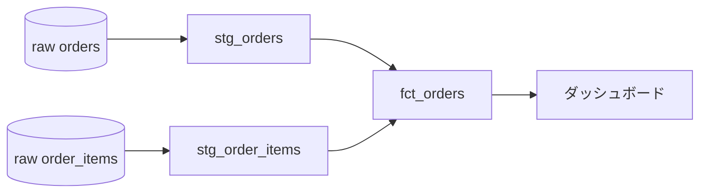
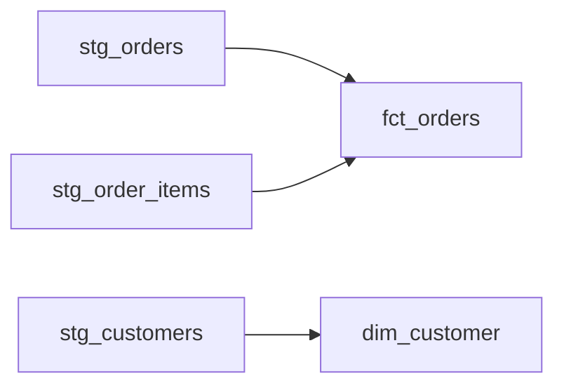

# 変換とモジュール設計 — dbt 的な考え方

生データはそのままでは使えない。注文テーブルにはキャンセルが混じり、金額は明細にバラけ、顧客名はIDのまま。これらを「分析できる形」に磨く工程が**変換（transformation）**だ。問題は、その変換ロジックを一枚の巨大なSQLに書くと、誰も触れない化石になることだ。このレッスンでは、dbt（data build tool）が広めた「変換をソフトウェアのように設計する」考え方を学ぶ。

## 直感: レゴブロックで組み立てる

500行のSQLは、一体成型のプラスチック模型だ。一箇所直したいだけでも全体を作り直すしかなく、壊すのが怖くて誰も触らなくなる。

dbt的な発想は、変換を**小さなブロック（model）の組み合わせ**にすることだ。各ブロックは「1つのSELECT文 = 1つのテーブル/ビュー」。ブロック同士を積み上げて、最終的な分析テーブルを作る。



:::insight
model とは「1本のSELECT文が書かれた .sql ファイル」のこと。実行するとそのSELECT結果がテーブルまたはビューとして物理化される。CREATE TABLE は書かない。SELECT の中身だけに集中する。
:::

## 正確な定義: model と ref()

dbtでは各SQLファイルが1つのmodelになる。モデルが他のモデルを参照するときは、テーブル名を直接書かず `ref()` 関数を使う。

```sql
-- models/staging/stg_orders.sql
-- 生のordersを「分析しやすい形」に整える層
select
    order_id,
    customer_id,
    order_date,
    status
from raw.orders
where status != 'pending'   -- 確定していない注文は除外
```

```sql
-- models/marts/fct_orders.sql
-- 注文粒度のファクト。明細金額を注文単位に集約する
select
    o.order_id,
    o.customer_id,
    o.order_date,
    o.status,
    sum(oi.quantity * oi.unit_price) as amount
from {{ ref('stg_orders') }} o
join {{ ref('stg_order_items') }} oi
    on o.order_id = oi.order_id
group by 1, 2, 3, 4
```

`{{ ref('stg_orders') }}` はビルド時に実際のテーブル名（例 `analytics.stg_orders`）へ置き換わる。これがもたらす価値は2つある。

1. **依存関係が自動で解ける**: `fct_orders` は `stg_orders` を参照しているので、dbtは「stgを先に、fctを後に」という実行順序を自動で決める（DAGを構築する）。手動で順番を管理しなくていい。
2. **スキーマ非依存**: 開発環境・本番環境でテーブルの場所が違っても、`ref()` がよしなに解決する。



## DRY: 定義を1か所に

同じ計算を何度も書くと、変更時に全箇所を直す羽目になり、直し漏れがバグになる。これが失敗モード「siloed / ossified」の温床だ。たとえば「売上 = quantity × unit_price」という定義は、stg層で1度だけ書く。

```sql
-- models/staging/stg_order_items.sql
select
    order_item_id,
    order_id,
    product_id,
    quantity,
    unit_price,
    quantity * unit_price as line_amount   -- 売上定義はここが唯一の出どころ
from raw.order_items
```

下流のmodelはこの `line_amount` を再利用する。定義が一本化されるので、「Aさんの売上とBさんの売上が合わない」が起きにくくなる。これは前段レッスンの「メトリクスの一元化」と同じ思想を、変換レイヤーで実践したものだ。

:::tip
レイヤーを分けると再利用が効く。慣習的に staging（生データの素直な整形・1ソース1model）→ intermediate（複数を結合した中間加工）→ marts（fct/dim の最終形）の3層に分ける。下流ほどビジネスロジックを濃くする。
:::

## テストとドキュメントが「同居」する

dbtの核心は、変換ロジックの隣にテストとドキュメントを置けることだ。これらはコードと同じリポジトリで、同じレビュー・同じバージョン管理に乗る。

```yaml
# models/marts/_marts.yml
models:
  - name: fct_orders
    description: "注文粒度のファクト。pending を除いた確定注文の金額を持つ。"
    columns:
      - name: order_id
        description: "注文の一意キー"
        tests:
          - unique
          - not_null
      - name: customer_id
        description: "顧客ID。dim_customer に必ず存在する。"
        tests:
          - not_null
          - relationships:
              to: ref('dim_customer')
              field: customer_id
      - name: amount
        description: "注文合計金額（明細の quantity × unit_price の総和）"
```

`dbt test` を実行すると、`unique`（重複なし）・`not_null`（欠損なし）・`relationships`（参照先に必ず存在＝外部キー整合）が自動チェックされる。`dbt docs` を実行すれば、この description から依存グラフ付きのドキュメントサイトが生成される。

:::insight
「定義（SQL）」「品質保証（test）」「説明（description）」が1セットで同居する。これがdbtの本質。ドキュメントが別の場所にあると必ず腐るが、コードの隣にあれば一緒に更新される。
:::

## よくあるアンチパターン

:::antipattern
**巨大な1枚SQL（God Model）**: 500行のSELECTに全変換を詰め込む。一部だけ再利用できず、テストもかけられず、変更が怖くて誰も触れなくなる（ossified）。→ 意味のある単位でmodelに割る。
:::

:::antipattern
**ref() を使わず生テーブル名を直書き**: `from analytics.stg_orders` と書くと依存解決が効かず、実行順序を人間が管理する羽目に。環境差にも弱い。→ 必ず `{{ ref('...') }}`。
:::

:::antipattern
**ドキュメント・テスト後回し**: 「あとで書く」は永遠に来ない。説明のないテーブルは使われず（unused）、定義が曖昧なまま誤用される（misused）。→ modelとyamlは同時にコミットする。
:::

## 演習

raw の `customers` から、分析用のディメンション `dim_customer` 相当を作るstaging model `stg_customers.sql` のSELECT本文を書こう。要件: `customer_id` `name` `country` `signup_date` を選び、`country` が NULL の行は `'unknown'` で埋めること。

解答例:

```sql
-- models/staging/stg_customers.sql
select
    customer_id,
    name,
    coalesce(country, 'unknown') as country,
    signup_date
from raw.customers
```

発展: この `stg_customers` を `ref()` で参照し、国別の顧客数を出す `int_customers_by_country` を書いてみよう。

```sql
-- models/intermediate/int_customers_by_country.sql
select
    country,
    count(*) as customer_count
from {{ ref('stg_customers') }}
group by country
```

## まとめ

- 変換は巨大な1枚SQLではなく、**小さなmodel（1 SELECT = 1ファイル）の組み合わせ**として設計する。
- `ref()` でmodel間の依存を表現すると、実行順序（DAG）が自動で解決され、環境差にも強くなる。
- 計算の定義は1か所に集約（DRY）。下流は再利用するだけにして、定義のズレと誤用を防ぐ。
- test（unique/not_null/relationships）とdescriptionをSQLの隣に同居させることで、品質保証とドキュメントが腐らず一緒に更新される。
- レイヤー分割（staging → intermediate → marts）が再利用性と安定インターフェースを生み、「価値がチームに閉じる」「変更できない」を防ぐ。
