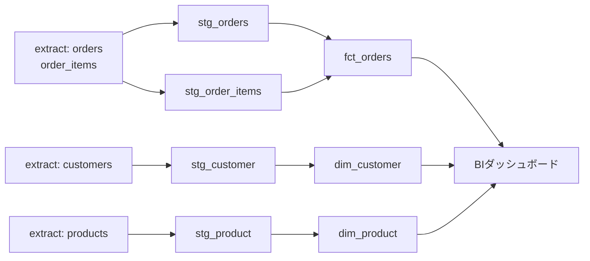

# オーケストレーション — DAG と依存・再実行

データ基盤は「テーブルを作るSQL」の集まりではない。それらを**正しい順番で、正しいタイミングで、失敗しても安全に**走らせる仕組みがあって初めて毎朝ダッシュボードに数字が並ぶ。その指揮者が「オーケストレーション」だ。

## 直感をつかむ — 料理の段取り

カレーを作るとき、玉ねぎを炒める前に肉を煮込むことはできないし、ルウは野菜が煮えてから入れる。手順には**順番（依存）**があり、毎日同じ時刻に作るなら**スケジュール**があり、鍋を焦がしたら**やり直す**。オーケストレーションはこの「段取り」をソフトウェアで表現したものだ。

## 正確な定義 — DAGとタスク依存

オーケストレーションの中心概念は **DAG（Directed Acyclic Graph / 有向非巡回グラフ）** だ。

- **有向（Directed）**: 矢印に向きがある。「AのあとB」という順序を表す。
- **非巡回（Acyclic）**: ぐるっと一周して戻る経路がない。AがBに依存し、BがAに依存する、は禁止。循環があると「どちらを先に実行すべきか」が永遠に決まらないからだ。

各ノードを **タスク（task）** と呼ぶ。タスクは「stg_orders を作る」「dim_customer を更新する」といった処理の最小単位。矢印は **依存（dependency）**、つまり「上流が成功してから下流を動かす」という制約を表す。



この図が示すとおり、`fct_orders` は `stg_orders` と `stg_order_items` の両方が揃わないと作れない。逆に `dim_customer` と `dim_product` は互いに無関係なので**並列**に走らせてよい。DAGは「何を待つべきか」と「何を同時にやれるか」を同時に表現する。

:::insight DAGは順序の宣言であって手続きではない
「Aを実行し、次にBを実行し…」と手続き的に書くのではなく、「Bの上流はAだ」と依存だけを宣言する。実行順序はオーケストレータが依存から自動で導出する。これにより並列化・部分再実行・依存の差し替えが効くようになる。
:::

## 具体例 — Airflowで依存を宣言する

代表的なオーケストレータ Airflow では、上のDAGをPythonで擬似的にこう書く（実コードを簡略化したイメージ）。

```python
from airflow import DAG
from airflow.operators.bash import BashOperator
import pendulum

with DAG(
    dag_id="daily_marts",
    schedule="0 5 * * *",          # 毎日05:00に実行（cron式）
    start_date=pendulum.datetime(2026, 1, 1, tz="Asia/Tokyo"),
    catchup=True,                  # 過去分の取りこぼしを埋める
    default_args={"retries": 3, "retry_delay": pendulum.duration(minutes=5)},
) as dag:

    stg_orders   = BashOperator(task_id="stg_orders",   bash_command="dbt run -s stg_orders")
    stg_items    = BashOperator(task_id="stg_items",    bash_command="dbt run -s stg_order_items")
    fct_orders   = BashOperator(task_id="fct_orders",   bash_command="dbt run -s fct_orders")

    # 依存の宣言: stg_orders と stg_items が成功してから fct_orders
    [stg_orders, stg_items] >> fct_orders
```

ポイントは最終行の `>>`。これが矢印そのもので、「左が終わってから右」という依存を宣言している。実行順序を自分でループに書く必要はない。

## スケジュール・リトライ・バックフィル

オーケストレーションが手動実行と決定的に違うのは、次の3つを面倒見てくれる点だ。

| 機能 | 役割 | 上の例での設定 |
|------|------|----------------|
| スケジュール | いつ走らせるか（cron式） | `0 5 * * *`（毎朝5時） |
| リトライ | 一時的失敗を自動で再試行 | `retries=3`, 5分間隔 |
| バックフィル | 過去の未実行分をさかのぼって埋める | `catchup=True` |

**リトライ**は、ネットワーク瞬断やAPIの一時的な429など「もう一度やれば通る」失敗を救う。**バックフィル（backfill）**は、3日間DAGが止まっていた・新しい集計を過去にさかのぼって作りたい、というときに「6/10ぶん・6/11ぶん・6/12ぶん」と日付ごとに過去分を再実行する仕組みだ。

:::tip 失敗時の挙動を設計する
タスクが失敗したら、下流は自動で実行を止まる（skipまたはupstream_failed）。これは正しい挙動だ。壊れた `stg_orders` をもとに `fct_orders` を作ってしまうと、間違った数字が静かにBIへ流れる。「止まる」ことは「腐ったデータを配らない」ための防波堤になる。
:::

## 冪等な再実行がすべての土台

リトライもバックフィルも、ある一点が崩れると一気に危険物になる。それが **冪等性（idempotency）** だ。

冪等とは「同じ処理を**何回実行しても結果が同じ**」という性質。`6/12ぶん` のタスクを2回走らせても、6/12のデータが二重に積まれてはいけない。

```sql
-- アンチパテルン: 追記するだけ。再実行で6/12分が二重に入る
INSERT INTO fct_orders
SELECT order_id, customer_key, order_date_key, amount, status
FROM stg_orders
WHERE order_date = DATE '2026-06-12';
```

冪等にするには「その日付ぶんを消してから入れ直す」か、宣言的に上書きする。

```sql
-- 冪等: 対象パーティション(日付)を削除してから再投入。何度流しても同じ結果
DELETE FROM fct_orders WHERE order_date_key = 20260612;

INSERT INTO fct_orders
SELECT order_id, customer_key, order_date_key, amount, status
FROM stg_orders
WHERE order_date = DATE '2026-06-12';
```

:::warning 冪等でないタスクは再実行できない
冪等でないと「リトライすると重複する」「バックフィルすると数字が膨らむ」ため、運用者は再実行を怖がるようになる。すると障害のたびに手作業の復旧が必要になり、誰も触れない神聖な領域が生まれる。冪等性は再実行を**安全な日常操作**に変えるための前提条件だ。
:::

## よくあるアンチパターン

:::antipattern 時刻でごまかす擬似依存
「Bは06:00に走らせれば、05:00のAは終わってるだろう」と時刻のズレで順序を担保するやり方。Aが少し遅れた瞬間、Bは未完成のデータを読む。依存は時刻ではなく**DAGの矢印**で宣言する。
:::

:::antipattern 全部入りの巨大単一タスク
抽出から集計までを1本のスクリプトにまとめると、途中で失敗しても「最初から全部やり直し」になる。タスクを適切に分割すれば、失敗したタスクとその下流だけを再実行できる。

これは失敗モード「使われすぎて変更できない（ossified）」に直結する。巨大な一枚岩は、誰も部分修正できず、依存も見えず、やがて誰も手を入れられない化石になる。
:::

### 腐らせないポイント（失敗モード4: ossified）

オーケストレーションが腐ると「**使われすぎて変更できない**」基盤になる。防ぐ要点はこうだ。

- **依存は明示的に宣言する**: 時刻トリックでなくDAGの矢印で。誰が見ても上下流が分かる＝安全に組み替えられる。
- **タスクは疎結合・小さく分割する**: 部分再実行を可能にし、1タスクの差し替えが全体を巻き込まないようにする。
- **冪等にする**: 再実行を怖くなくすことで、変更・修正・復旧が日常操作になる。冪等でない基盤は「触ると壊れる」ので凍結される。
- **オーナーシップを置く**: 各DAG・各タスクに責任者を明記する。持ち主のいないパイプラインは廃止も改修もされず固着する。

これらが効いている基盤は、依存を足したり順序を変えたりが安全にでき、化石化しない。

## 演習

共通スキーマの `fct_orders`（粒度=注文）を毎日バックフィルする状況を考える。次のタスクSQLは冪等ではない。冪等な形に書き直しなさい（対象日は変数 `:run_date` とし、`order_date_key` はYYYYMMDD整数とする）。

```sql
INSERT INTO fct_orders (order_id, customer_key, order_date_key, amount, status)
SELECT o.order_id,
       c.customer_key,
       CAST(REPLACE(CAST(o.order_date AS STRING), '-', '') AS INT64),
       SUM(oi.quantity * oi.unit_price),
       o.status
FROM orders o
JOIN order_items oi ON oi.order_id = o.order_id
JOIN dim_customer c ON c.customer_id = o.customer_id
WHERE o.order_date = :run_date
GROUP BY o.order_id, c.customer_key, o.order_date, o.status;
```

### 解答例

実行対象日のパーティションを先に削除してから投入する。これで何度流しても結果は一意になる。

```sql
-- 1) 対象日ぶんを消す（再実行の二重計上を防ぐ）
DELETE FROM fct_orders
WHERE order_date_key = CAST(REPLACE(CAST(:run_date AS STRING), '-', '') AS INT64);

-- 2) 同じ日付ぶんを入れ直す
INSERT INTO fct_orders (order_id, customer_key, order_date_key, amount, status)
SELECT o.order_id,
       c.customer_key,
       CAST(REPLACE(CAST(o.order_date AS STRING), '-', '') AS INT64),
       SUM(oi.quantity * oi.unit_price),
       o.status
FROM orders o
JOIN order_items oi ON oi.order_id = o.order_id
JOIN dim_customer c ON c.customer_id = o.customer_id
WHERE o.order_date = :run_date
GROUP BY o.order_id, c.customer_key, o.order_date, o.status;
```

DELETE→INSERT を1つのタスク（理想的にはトランザクション）にまとめておけば、バックフィルでもリトライでも安全に再実行できる。

## まとめ

- オーケストレーションは処理の「段取り」をソフトウェアにしたもので、中心概念は**DAG（有向非巡回グラフ）**。依存は時刻でなく矢印で宣言する。
- DAGは「何を待つか」と「何を並列にできるか」を同時に表し、実行順序はオーケストレータが自動導出する。
- スケジュール・リトライ・バックフィルが手動実行との決定的な差。失敗時は下流を止め、腐ったデータを配らない。
- **冪等性**がすべての土台。同じ処理を何度流しても結果が同じであれば、再実行は安全な日常操作になる。
- 依存の明示・タスクの疎結合・冪等性・オーナーシップが、基盤の**ossified（変更できない化石化）**を防ぐ。
