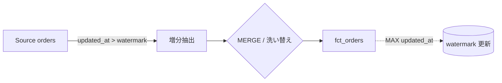

# 増分処理と冪等性の実装

データ基盤を毎日まわすとき、いちばん怖いのは「ジョブが途中で失敗して、もう一度走らせたら数字が二重に膨らんだ」という事故だ。再実行が怖くてバッチを手作業で慎重にまわす運用は、確実に "腐る" 一歩手前にある。このレッスンでは、何度走らせても結果が同じになる設計——**冪等性**と、それを支える**増分処理**のパターンを学ぶ。

## 直感をつかむ

毎朝、昨日ぶんの注文だけを処理して大きなテーブルに足していく作業を想像してほしい。全件を毎回読み直すのは重い。だから「前回どこまで処理したか」を覚えておき、その続きだけを処理する。これが増分処理だ。

ただし増分処理は「足し算」になりがちで、同じ日を二度走らせると二重計上が起きる。そこで「足す」のではなく「あるべき状態に合わせる」発想に切り替える。これが冪等性だ。

:::insight 冪等性とは
同じ操作を1回実行しても100回実行しても、最終結果が変わらない性質のこと。「APPEND（追記）」は冪等でなく、「上書き・置換・MERGE」は冪等にできる。再実行で壊れない基盤の土台になる。
:::

## 正確な定義

- **増分処理（incremental）**: 全データではなく、前回処理以降に増えた/変わった分だけを処理する方式。
- **高水位（ウォーターマーク, watermark）**: 「ここまで処理済み」を示すしおり。多くは `MAX(updated_at)` や日付。次回はこの値より新しい行だけを取り込む。
- **MERGE（upsert）**: キーが既にあれば UPDATE、なければ INSERT。同じ入力なら何度流しても同じ状態になる。
- **洗い替え（full refresh / 全件再構築）**: 対象範囲を一度消してから入れ直す。範囲が冪等なら最強にシンプル。



## 具体例: ウォーターマーク + MERGE

ソースの `orders` を増分で `fct_orders` に取り込む。前回処理した時刻より新しい行だけを抽出し、`order_id` をキーに MERGE する。

```sql
-- 1. 前回の高水位を取得（初回は遠い過去を返す）
-- last_watermark = SELECT COALESCE(MAX(processed_at), '1970-01-01') FROM fct_orders;

-- 2. 増分ぶんだけを upsert
MERGE INTO fct_orders AS t
USING (
  SELECT order_id, customer_id AS customer_key, order_date, status, updated_at
  FROM orders
  WHERE updated_at > :last_watermark   -- 増分抽出
) AS s
ON t.order_id = s.order_id             -- 冪等性の鍵となる自然キー
WHEN MATCHED THEN UPDATE SET
  status = s.status,
  order_date = s.order_date,
  processed_at = s.updated_at
WHEN NOT MATCHED THEN INSERT
  (order_id, customer_key, order_date, status, processed_at)
  VALUES (s.order_id, s.customer_key, s.order_date, s.status, s.updated_at);
```

同じ `:last_watermark` で二度流しても、2回目は MATCHED 側に入って UPDATE されるだけ。行は増えない。これが冪等な増分処理だ。

## 具体例: パーティション洗い替え（delete-insert）

MERGE が使えない、あるいはキーの重複が読みにくいときは、**日付パーティション単位の洗い替え**が堅牢でわかりやすい。「その日のぶんを丸ごと消して入れ直す」ので、何度走らせても同じ。

```sql
-- 対象日のぶんを削除してから挿入（トランザクション内で）
DELETE FROM fct_orders WHERE order_date = :target_date;

INSERT INTO fct_orders (order_id, customer_key, order_date, status, processed_at)
SELECT order_id, customer_id, order_date, status, CURRENT_TIMESTAMP
FROM orders
WHERE order_date = :target_date;
```

処理単位（粒度）を「日付」に固定すると、再実行や過去日の作り直しが安全になる。dbt の incremental モデルや BigQuery の `INSERT OVERWRITE`、Spark の `replaceWhere` も発想は同じだ。

## 遅延到着データ（late-arriving data）

現実のデータは時間どおりに来ない。6/12 のイベントが 6/13 になってから届くことはざらにある。`event_time > watermark` だけで追うと、これを取りこぼす。

:::warning ウォーターマークの取りこぼし
取り込み時刻ではなくイベント発生時刻でしおりを進めると、遅れて届いた古いデータが「もう処理済みの範囲」に落ちて永久にスキップされる。
:::

対策は2つ。第一に、しおりは**取り込み時刻（`ingested_at` / `updated_at`）**で進め、出力の振り分けは**イベント時刻**で行う。第二に、安全のため**直近 N 日を毎回作り直す**（lookback window）。

```sql
-- 直近3日ぶんを毎回洗い替え、遅延データを回収する
DELETE FROM fct_orders WHERE order_date >= DATE_SUB(:target_date, INTERVAL 3 DAY);

INSERT INTO fct_orders (order_id, customer_key, order_date, status, processed_at)
SELECT order_id, customer_id, order_date, status, CURRENT_TIMESTAMP
FROM orders
WHERE order_date >= DATE_SUB(:target_date, INTERVAL 3 DAY);
```

## よくあるアンチパターン

:::antipattern INSERT で足すだけの増分
`INSERT ... SELECT ... WHERE date = :today` をリトライ用の重複排除なしで運用する。失敗→再実行のたびに二重計上が積み上がる。集計値が静かに狂い、誰も気づかない。
:::

:::antipattern ウォーターマークを処理「前」に進める
抽出して即しおりを更新し、その後の書き込みが失敗。範囲はスキップされたまま欠損する。しおりの更新は書き込み成功を確認した**後**に、できれば同一トランザクションで。
:::

## 腐らせないポイント

このレッスンの焦点は失敗モード **4: 使われすぎて変更できない（ossified）** だ。冪等な増分設計は、基盤を「触れる」状態に保つための保険である。

- **再実行が安全だと、変更も安全になる**。ロジックを直したら過去ぶんを作り直すだけ。冪等でない基盤は「作り直すと壊れる」ため、誰も手を入れられず硬直化する。
- **粒度（日付パーティション等）を安定インターフェースとして公開**し、内部の実装（MERGE か洗い替えか）は隠す。利用者は「この日のデータは正しい」とだけ信じればよく、内部を差し替えても契約は壊れない。
- **バックフィル戦略を最初から用意する**。「特定日だけ作り直せる」設計なら、定義変更・遅延データ・障害復旧すべてに同じ手順で対応でき、廃止・移行も怖くなくなる。

## 演習

問1. `order_items`（粒度=注文明細）を `fct_order_items(order_item_id, order_id, product_key, quantity, unit_price, processed_at)` に冪等に取り込む MERGE 文を書け。キーは `order_item_id`、増分条件は使わず全件 upsert でよい。

問2. 問1のテーブルで、特定日 `:target_date` ぶんだけを安全に作り直したい（遅延データ考慮なし）。delete-insert で書け。`order_items` には日付がないため `orders.order_date` を結合して使うこと。

解答例:

```sql
-- 問1
MERGE INTO fct_order_items AS t
USING (
  SELECT order_item_id, order_id, product_id AS product_key, quantity, unit_price
  FROM order_items
) AS s
ON t.order_item_id = s.order_item_id
WHEN MATCHED THEN UPDATE SET
  order_id = s.order_id, product_key = s.product_key,
  quantity = s.quantity, unit_price = s.unit_price, processed_at = CURRENT_TIMESTAMP
WHEN NOT MATCHED THEN INSERT
  (order_item_id, order_id, product_key, quantity, unit_price, processed_at)
  VALUES (s.order_item_id, s.order_id, s.product_key, s.quantity, s.unit_price, CURRENT_TIMESTAMP);

-- 問2
DELETE FROM fct_order_items
WHERE order_id IN (SELECT order_id FROM orders WHERE order_date = :target_date);

INSERT INTO fct_order_items (order_item_id, order_id, product_key, quantity, unit_price, processed_at)
SELECT oi.order_item_id, oi.order_id, oi.product_id, oi.quantity, oi.unit_price, CURRENT_TIMESTAMP
FROM order_items oi
JOIN orders o ON oi.order_id = o.order_id
WHERE o.order_date = :target_date;
```

## まとめ

- 増分処理は「前回どこまで」を示すウォーターマークで続きだけを処理する。軽いが二重計上の罠がある。
- 冪等性（同じ操作を何度実行しても結果が同じ）は MERGE/upsert やパーティション洗い替えで実現する。APPEND は避ける。
- 遅延到着データは、しおりを取り込み時刻で進め、直近 N 日を lookback で作り直して回収する。
- ウォーターマーク更新は書き込み成功後に。処理前に進めると欠損する。
- 再実行・バックフィルが安全な設計は、基盤を硬直化（ossified）から守る最大の保険になる。
