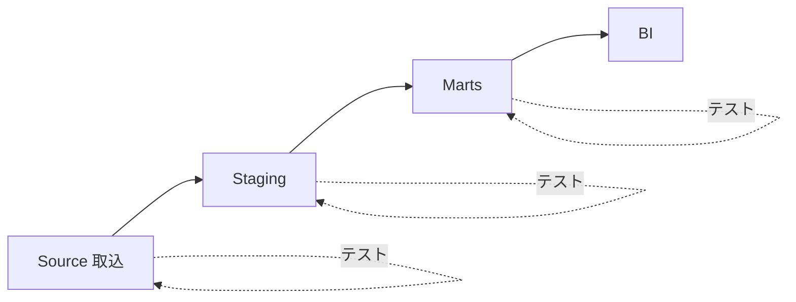

# データテスト — not null・unique・関係性

データは静かに壊れる。コードのバグはエラーで止まるが、データの異常は「数字がちょっと変」なまま下流へ流れ、誰かがダッシュボードを二度見するまで気づかれない。そこで効くのがデータテストだ。

:::insight
アプリのテストが「コードの振る舞い」を確かめるのに対し、データテストは「テーブルの中身が約束どおりか」を確かめる。約束を機械が毎回チェックするから、人間が信じて使える。
:::

## データテストとは何か

データテストとは、テーブルに対して「この条件を満たしているはず」という前提を SQL で表現し、満たさない行（=違反行）が出たら失敗とする仕組みだ。前提を文章で書く代わりに、実行可能なチェックとして固定する。これは前のレッスンで扱った「データ契約」を、実際のデータの上で守られているか継続検証する手段でもある。

## 5つの基本テスト

現場で9割をカバーする5種類を押さえる。共通スキーマで具体例を見る。

### 1. not null（必須）

主キーや外部キー、金額など「欠けてはいけない列」が NULL でないことを確認する。

```sql
-- customer_id が NULL の注文は契約違反 → 件数が出たら失敗
select count(*) as failures
from orders
where customer_id is null;
```

### 2. unique（一意）

主キーが重複していないこと。重複すると JOIN で行が増殖し、売上が水増しされる典型的な事故になる。

```sql
-- order_id が2回以上現れたら失敗
select order_id, count(*) as n
from orders
group by order_id
having count(*) > 1;
```

### 3. accepted values（取りうる値）

カテゴリ列が決められた値の集合に収まっているか。`status` に想定外の文字列が混ざると集計の条件分岐がすり抜ける。

```sql
-- 'completed','cancelled','pending' 以外があれば失敗
select status, count(*) as n
from orders
where status not in ('completed', 'cancelled', 'pending')
group by status;
```

### 4. 参照整合性（relationships）

外部キーが参照先に必ず存在すること。`order_items.product_id` が `products` にない=「幽霊商品」を売っていることになる。

```sql
-- 親の products に存在しない product_id を持つ明細を検出
select oi.order_item_id, oi.product_id
from order_items as oi
left join products as p on oi.product_id = p.product_id
where p.product_id is null;
```

### 5. 行数・鮮度（row count / freshness）

「毎日数千件入るはずの注文が今日は0件」はパイプライン停止のサイン。件数や最新日時の範囲をチェックする。

```sql
-- 直近1日に注文が1件も入っていなければ失敗
select count(*) as recent_orders
from orders
where order_date >= current_date - interval '1' day
having count(*) = 0;
```

## yaml で宣言的に書く（dbt スタイル）

毎回 SQL を手書きすると数が増えて管理しきれない。dbt などのツールは、テストを yaml で宣言すると裏で上記の SQL を自動生成してくれる。意図が読みやすく、レビューもしやすい。

```yaml
models:
  - name: orders
    columns:
      - name: order_id
        tests:
          - not_null
          - unique
      - name: customer_id
        tests:
          - not_null
          - relationships:
              to: ref('customers')
              field: customer_id
      - name: status
        tests:
          - accepted_values:
              values: ['completed', 'cancelled', 'pending']
```

## いつ・どこで実行するか



- **取込直後（source）**: 生データの not null・鮮度を見る。壊れた入力を早期に止める。
- **変換後（staging/marts）**: unique・参照整合性・accepted values を見る。JOIN や集計で粒度が崩れていないか確認する。

:::tip
テストは「下流に流す前」に置く。BI で気づくのは最も遅く、最も高くつく。源流に近いほど原因の切り分けが速い。
:::

## CI への組み込み

テストは手で叩くと忘れる。パイプラインの実行ジョブと CI（プルリクエスト時の自動チェック）に組み込み、失敗したら止める／マージさせないのが要だ。

```yaml
# CI 例: PR ごとにビルド＆テスト
steps:
  - run: dbt build        # 変換とテストを実行し、テスト失敗で非ゼロ終了
  - run: dbt source freshness   # 取込の鮮度を検証
```

:::warning
すべてを「失敗（error）」にすると、軽微な違反でパイプライン全体が止まり、やがて誰もテストを足さなくなる。重大度を error / warn に分け、致命的なもの（主キー重複など）だけを停止条件にする。
:::

## よくあるアンチパターン

:::antipattern
**テストを書かず目視に頼る**。「いつも見てるから大丈夫」は人が辞めた瞬間に崩れる。
**全部 error で硬直**。少しの warn 違反でも止まり、運用が回らずテスト自体が無効化される。
**BI でしか気づかない**。最下流での発覚は調査範囲が広く、信頼も最も損なう。
:::

## 腐らせないポイント

このレッスンは失敗モード3「想定外の使い方をされる（misused）」に直結する。

データテストは、データ契約を「言いっぱなし」にせず機械で守らせる装置だ。`status` が想定値だけ、主キーが一意、外部キーが必ず親に存在する——これらが保証されているからこそ、利用者は内部を知らなくても安心して JOIN し集計できる。逆にテストがなければ、定義の揺れや粒度の崩れが静かに混入し、各自が独自の前処理で「補正」しはじめ、想定外の使われ方が増殖する。テストは契約の番人であり、misused を入口で止める。

## 演習

共通スキーマに対し、次の2つのデータテストを SQL で書け。

1. `order_items.order_id` が `orders` に存在しない明細（孤児行）を検出する。
2. `products.price` が NULL または 0 以下の行を検出する。

### 解答例

```sql
-- 1. 参照整合性: 親 orders にない order_id を持つ明細
select oi.order_item_id, oi.order_id
from order_items as oi
left join orders as o on oi.order_id = o.order_id
where o.order_id is null;

-- 2. not null + 値域: 価格が欠損 or 非正
select product_id, price
from products
where price is null or price <= 0;
```

## まとめ

- データテストは「テーブルの中身が約束どおりか」を機械で継続検証する仕組み。
- 基本は5種類: not null・unique・accepted values・参照整合性・行数/鮮度。
- yaml で宣言的に書くと、意図が読みやすく数が増えても管理できる。
- 実行は下流に流す前（source 取込直後と変換後）。BI での発覚が最も高コスト。
- CI とパイプラインに組み込み、重大度を error/warn に分けて運用を止めない。
- テストはデータ契約の番人であり、misused（想定外の使われ方）を入口で防ぐ。
