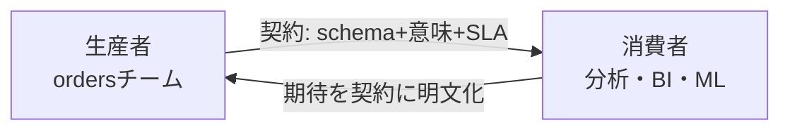

# データ契約 — Data Contracts

データを作る人（生産者）と使う人（消費者）の間には、たいてい暗黙の前提がある。「このカラムは絶対NULLにならないはず」「金額は円単位のはず」――その前提が一言も書かれていないと、ある日サイレントに壊れる。**データ契約（Data Contract）は、この暗黙の前提を明文化し、両者の約束として固定する仕組み**だ。このレッスンは「想定外の使い方（misused）」と「変更できない硬直（ossified）」を同時に防ぐ核心を扱う。

## 直感：APIにあって、データにないもの

Webエンジニアは当たり前のようにAPIの仕様書を書く。「このエンドポイントは200で `{id, name}` を返す」と決め、勝手に形を変えたら呼び出し側が壊れることを知っているからだ。ところがテーブルやイベントログには、なぜか仕様書がないことが多い。

:::insight
データ契約とは「テーブル版のAPI仕様書」である。生産者が好きにスキーマを変えられないように縛り、消費者が安心して依存できる土台を作る。
:::

## 正確な定義：契約の4要素

データ契約は最低限この4つを含む。

| 要素 | 中身 | 例 |
|---|---|---|
| スキーマ（Schema） | カラム名・型・NULL可否・制約 | `amount` は `decimal`、NOT NULL |
| 意味（Semantics） | 各カラムが何を表すか、単位、粒度 | `amount` は税込・円、行粒度は「注文1件」 |
| SLA / 品質保証 | 鮮度・遅延・欠損率・更新頻度 | 毎日09:00までに前日分が揃う、欠損率 < 0.1% |
| 所有者（Owner） | 責任を持つチーム・連絡先 | orders基盤チーム、#data-orders |

スキーマだけでは足りない。`status` というカラムがあっても、取りうる値が `'completed','cancelled','pending'` の3つだけだと書かれていなければ、消費者は `'shipped'` が来ないと信じてよいか分からない。**意味と制約まで含めて初めて約束になる**。

## 生産者と消費者の約束



契約があると関係が逆転する。契約前は「消費者が生産者のテーブルをこっそり覗いて、勝手に依存する」状態だった。契約後は「生産者が公開すると宣言した範囲だけが、消費者の依存対象になる」。つまり**契約に書いていないカラムは、いつ消えても文句を言えない**。これが疎結合とオーナーシップの出発点になる。

## 契約をコード化する

仕様書がWordやNotionの中にあると、誰も読まず、検証もできない。契約は機械可読な形で書き、CIで自動チェックするのが鉄則だ。`fct_orders`（粒度＝注文1件）の契約をYAMLで書く例。

```yaml
# contracts/fct_orders.yml
model: fct_orders
owner: orders-platform
grain: 注文1件（order_idで一意）
sla:
  freshness: 24h        # 前日分が翌朝までに揃う
  max_null_rate: 0.001
columns:
  - name: order_id
    type: string
    unique: true
    not_null: true
  - name: customer_key
    type: integer
    not_null: true
    references: dim_customer.customer_key   # 外部キー＝関係の明文化
  - name: amount
    type: decimal
    not_null: true
    description: 税込金額・円
  - name: status
    type: string
    not_null: true
    accepted_values: ['completed', 'cancelled', 'pending']
```

JSON Schemaでイベント `events` の契約を書くなら、取りうる `event_type` を `enum` で固定する。

```json
{
  "type": "object",
  "required": ["event_id", "customer_id", "event_type", "event_time"],
  "properties": {
    "event_type": { "enum": ["view", "add_to_cart", "purchase"] },
    "event_time": { "type": "string", "format": "date-time" }
  }
}
```

## 契約破棄の検知

契約は書いて終わりではない。**破られた瞬間に気づけて初めて意味がある**。検知は2層で行う。

1. スキーマ変更の検知（デプロイ前）: 生産者がカラム名変更や型変更をしようとしたら、CIで契約と照合してブロックする。
2. データ品質の検知（実行時）: パイプライン稼働中に契約違反データが流れていないか検査する。

たとえば「`status` に契約外の値が混入していないか」は次のSQLで監視できる。1行でも返れば契約違反としてアラートを出す。

```sql
-- 契約違反: accepted_values 外の status を検出
SELECT status, COUNT(*) AS violation_count
FROM fct_orders
WHERE status NOT IN ('completed', 'cancelled', 'pending')
GROUP BY status;
```

```sql
-- SLA違反: 前日分の注文が翌朝までに到着しているか（鮮度チェック）
SELECT MAX(order_date) AS latest_order_date,
       CURRENT_DATE - 1   AS expected_date
FROM fct_orders
HAVING MAX(order_date) < CURRENT_DATE - 1;  -- 行が返れば鮮度SLA違反
```

:::tip
品質チェックは生産者側のパイプライン末尾に置く。違反データを下流に流す前に止める（fail fast）ことで、消費者が壊れたデータで意思決定する事故を防げる。
:::

## よくあるアンチパターン

:::antipattern
**サイレントなカラム削除・リネーム**。生産者が `amount` を `total_amount` に改名し、下流のダッシュボードが翌朝全滅。契約とCIチェックがあれば、リネームはマージ前に弾かれる。
:::

:::warning
**意味の暗黙変更**。型もカラム名も同じまま、`amount` を税抜から税込に変えてしまう。スキーマは無傷でも消費者の数字は静かに狂う。だから契約には型だけでなく「単位・税の扱い」まで書く。
:::

:::antipattern
**契約 = 完全な変更禁止、という誤解**。契約は変更を禁じる鎖ではない。「変更するときの手続き（バージョニング・予告期間・廃止フロー）」を決める枠組みだ。破壊的変更は新バージョン（`fct_orders_v2`）を並走させ、旧版に廃止予告を出し、消費者の移行を待ってから消す。これが硬直（ossified）を防ぐ。
:::

## 腐らせないポイント

- **misused（想定外利用）対策**: 粒度・単位・取りうる値を契約に明記し、機械可読にして実行時に検証する。「`status` は3値だけ」と保証されれば、消費者は安心して `WHERE status='completed'` を書ける。曖昧さが消えれば誤用も消える。
- **ossified（硬直）対策**: 契約は「凍結」ではなく「変更の作法」を定めるもの。バージョニング・廃止予告・所有者の明示によって、依存が増えても安全に進化できるインターフェースになる。契約のない暗黙依存こそが、変更不能なレガシーを生む真犯人だ。

## 演習

`fct_orders`（粒度＝注文1件）に対し、契約の「`customer_key` は NOT NULL かつ `dim_customer` に必ず存在する」を検証するSQLを書け。違反行が返るようにすること。

解答例：

```sql
-- not_null 違反と参照整合性違反を同時に検出
SELECT f.order_id, f.customer_key
FROM fct_orders f
LEFT JOIN dim_customer d
  ON f.customer_key = d.customer_key
WHERE f.customer_key IS NULL      -- NOT NULL 違反
   OR d.customer_key IS NULL;     -- 参照先が存在しない（孤児行）
```

## まとめ

- データ契約は「テーブル版のAPI仕様書」。スキーマ・意味・SLA・所有者の4要素で生産者と消費者の約束を固定する。
- スキーマだけでは不十分。単位・粒度・取りうる値という「意味」まで書いて初めて誤用を防げる。
- 契約はYAML/JSON Schemaでコード化し、CI（デプロイ前）と品質チェック（実行時）の2層で破棄を検知する。
- 契約は変更禁止の鎖ではなく、バージョニングと廃止予告で安全に進化させるための枠組みである。
- 暗黙の依存こそがmisusedとossifiedの根源。契約はそれを明示の約束に置き換える。
