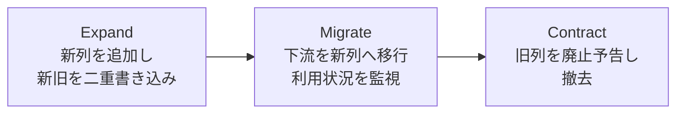

# スキーマ進化と後方互換

データ基盤は一度作ったら終わりではない。事業が伸びれば列が増え、要件が変われば型を見直したくなる。だが、よく使われるテーブルほど「迂闊に変更できない」状態に陥る。このレッスンでは、スキーマを**安全に育てる**ための原則と、現場で使える「expand-contract（並行運用 → 移行 → 撤去）」パターンを学ぶ。

## 直感をつかむ：建物の改築と同じ

住人が暮らしている建物を改築することを想像してほしい。「新しい部屋を増やす（増築）」のは、住人の生活を止めずにできる。だが「玄関を別の場所に移す」「リビングを半分の広さにする」のは、住人の動線を壊す。データのスキーマも同じだ。**追加は住人（＝下流の利用者）を邪魔しないが、削除や変更は住人の生活を直接壊す。**

## 正確な定義：後方互換とは何か

:::insight 後方互換（backward compatible）
スキーマを変更しても、**変更前のスキーマを前提に書かれた既存のクエリ・コード・ダッシュボードが、修正なしで動き続ける**こと。
:::

スキーマ変更は、後方互換性の有無で2種類に分けられる。

| 変更の種類 | 後方互換 | 具体例 |
|---|---|---|
| 列の追加（NULL許容） | あり（安全） | `customers` に `email` 列を足す |
| 新テーブルの追加 | あり（安全） | `dim_region` を新設する |
| 列の削除 | なし（破壊的） | `orders.status` を消す |
| 列名の変更 | なし（破壊的） | `amount` → `total_amount` |
| 型の変更 | なし（破壊的） | `quantity` を INT → STRING |
| 意味の変更 | なし（破壊的） | `amount` を税抜→税込に変える |

最後の「意味の変更」は見落としやすい。**列の名前も型も変わらないのに中身の定義が変わる**と、`SELECT amount` を書いていた全員が静かに間違った数字を見る。型が同じでも、定義が変われば破壊的変更だ。

:::warning
「型を STRING から STRUCT に広げるだけ」「列を NOT NULL から NULL許容に緩めるだけ」も、下流が古い形を前提にしていれば壊れる。"緩める方向"だから安全、とは限らない。互換性は必ず**利用者の前提**を基準に判断する。
:::

## 安全な追加の例

`orders` テーブルに、後から「決済方法」を持たせたいとする。追加なら下流を壊さない。

```sql
-- 安全: NULL許容で列を追加。既存のクエリは payment_method を知らないまま動き続ける
ALTER TABLE orders
  ADD COLUMN payment_method STRING;
```

既存の `SELECT order_id, status FROM orders` は何も変わらず動く。新しい列を使いたい人だけが `payment_method` を参照すればよい。これが「増築」だ。

## 破壊的変更を安全に行う：expand-contract パターン

では、どうしても破壊的変更が必要なときは？　たとえば `fct_orders.amount`（税抜）を `amount_excl_tax` と `amount_incl_tax` の2列に作り直したい。一気に消すと、`amount` を参照する全ダッシュボードが即死する。

ここで使うのが **expand-contract**（別名 parallel change）。「いきなり置き換えない。新旧を**並行運用**し、利用者を**移行**させ、誰も使わなくなってから**撤去**する」の3フェーズだ。



### フェーズ1：Expand（並行運用）

新しい列を**追加**する。旧列はそのまま残し、両方に正しい値を書き込む。この時点では後方互換が保たれており、誰も壊れない。

```sql
-- 新しい税抜・税込の列を追加（旧 amount は残したまま）
ALTER TABLE fct_orders ADD COLUMN amount_excl_tax NUMERIC;
ALTER TABLE fct_orders ADD COLUMN amount_incl_tax NUMERIC;

-- パイプラインで新旧すべてに値を入れる（二重書き込み）
-- amount は当面そのまま、新列にも同じ計算を流す
```

### フェーズ2：Migrate（移行）

下流の利用者に告知し、新列へクエリを書き換えてもらう。**誰がまだ旧列を使っているか**を計測することが肝心だ。推測で「もう誰も使ってないだろう」と消すのが事故の元。

```sql
-- 移行先: 利用者は新しい列を参照するよう書き換える
SELECT
  order_id,
  amount_incl_tax  -- 旧 amount の代わりにこちらを使う
FROM fct_orders;
```

:::tip
旧列がまだ参照されているかは、クエリログ（BigQuery なら `INFORMATION_SCHEMA.JOBS` の参照列情報）や、ビューを経由させてアクセスを観測する方法で確認できる。撤去の判断は**データで裏付ける**。
:::

### フェーズ3：Contract（撤去）

参照がゼロになり、十分な猶予期間（廃止予告 → 待機）を置いてから、ようやく旧列を消す。

```sql
-- 全員が移行したことを確認してから撤去
ALTER TABLE fct_orders DROP COLUMN amount;
```

このとき重要なのは、撤去まで**いつ消すか（廃止予告日）**を事前にアナウンスすることだ。「来月末に `amount` を廃止します。それまでに `amount_incl_tax` へ移行してください」と期限を切る。これがバージョニング・廃止戦略の最小単位になる。

## よくあるアンチパターン

:::antipattern いきなり ALTER で型変更・列削除
「もう使ってないはず」と確認せずに `DROP COLUMN` や型変更を本番に流す。翌朝、誰かのダッシュボードが真っ赤になる。破壊的変更は必ず expand-contract で段階化する。
:::

:::antipattern 列名を再利用して意味を変える
`amount` の名前を残したまま中身を税抜→税込にすり替える。エラーは出ないので最悪だ。誰も気づかず、数字だけが静かに狂う。**意味を変えるなら名前も変える。**
:::

:::antipattern 並行運用フェーズを飛ばして即移行を強制
新列を足した瞬間に旧列を消し、「今すぐ全員直して」と通達する。下流の修正が間に合わず障害になる。新旧の重なり期間を必ず設ける。
:::

## 演習

`dim_customer` の `country` 列（現在は `'JP'` のような国コード文字列）を、表示用の正式名称 `country_name`（例 `'Japan'`）へ移行したい。破壊的変更を避けて進める手順を、expand-contract の3フェーズに沿って書け。各フェーズで実行する SQL（または作業）を1つずつ示すこと。

解答例：

```sql
-- フェーズ1 Expand: 新列を追加し、パイプラインで両方に書き込む
ALTER TABLE dim_customer ADD COLUMN country_name STRING;
-- 既存の country はそのまま。country_name に 'JP'->'Japan' 等を変換して投入する

-- フェーズ2 Migrate: 下流に告知。利用者は新列へ書き換える
SELECT customer_id, country_name FROM dim_customer;  -- 旧 country の代わりに参照
-- 同時に、まだ country を参照しているクエリが無いか計測する

-- フェーズ3 Contract: 参照ゼロ＆廃止予告期間の経過を確認してから撤去
ALTER TABLE dim_customer DROP COLUMN country;
```

ポイントは、フェーズ1とフェーズ2の間で**新旧が同時に存在する**こと。これにより、移行が終わっていない利用者も壊れない。

## まとめ

- スキーマ変更は「追加（安全）」と「削除・型変更・意味変更（破壊的）」に分かれる。後方互換の判断基準は常に**利用者の前提**。
- 列名・型が同じでも**意味が変われば破壊的変更**。意味を変えるなら名前を変える。
- 破壊的変更は **expand-contract（並行運用 → 移行 → 撤去）** で段階化し、新旧が重なる期間を必ず設ける。
- 撤去は推測でなく**利用状況の計測**で判断し、廃止予告日を事前にアナウンスする。
- これらは「使われすぎて変更できない（ossified）」基盤を、壊さず進化させ続けるための型である。
