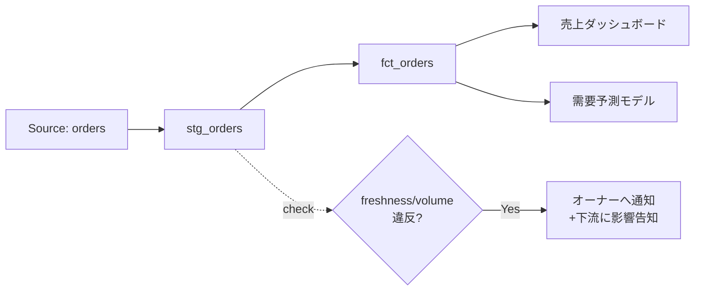

# データ可観測性 — freshness・volume・SLA/SLO

データ基盤は、壊れるときに大きな音を立てて壊れてくれない。テーブルは存在し、クエリは成功する。ただ中身が「昨日の朝で止まっている」「行数が半分になっている」だけだ。気づくのはたいてい、ダッシュボードを見た営業から「数字おかしくない?」と連絡が来たとき。これは最悪のパターンだ。基盤への信頼は一度こうした事故で失墜すると、二度と使われなくなる(unused)か、誰もが手元で勝手に再計算する(misused)。

可観測性(Observability)とは、外から見える出力だけで「中で何が起きているか」を推測できる状態を指す。要は「壊れたことに、利用者より先に自分で気づける」ための仕組みだ。

:::insight
監視(monitoring)が「あらかじめ決めた異常を見張る」ことなら、可観測性は「予期しない異常も出力の変化から察知できる」性質。データ基盤では、利用者が気づく前に運用者が気づけるかどうかが信頼の分かれ目になる。
:::

## 可観測性の5つの柱

データ可観測性は、次の5つの観点でデータの健康状態を測る。

| 柱 | 何を見るか | 壊れている例 |
|---|---|---|
| Freshness(鮮度) | データはいつ更新されたか | ETLが止まり昨日のデータのまま |
| Volume(量) | 行数・データ量は妥当か | 連携漏れで注文が半分しか来ていない |
| Schema(構造) | 列・型は変わっていないか | 上流が `amount` を `total` に改名 |
| Distribution(分布) | 値の範囲・null率は妥当か | 金額に負数、country が全部null |
| Lineage(系譜) | どこから来てどこで使われるか | 壊れた表の下流影響範囲が不明 |

最初の3つ(freshness/volume/schema)は機械的に検知しやすく、優先的に整備する価値が高い。distribution は業務知識が要る分、効果も大きい。lineage は単体のチェックではなく「壊れたときに被害範囲を即座に把握する地図」として効く。

## SLI・SLO・SLA — 約束を数値にする

「ちゃんと動いている」を感覚で語ると、誰も責任を持てない。約束を数値に落とすのが SLI/SLO/SLA だ。

- **SLI (Indicator)**: 実測する指標。例「fct_orders は毎朝9時時点で最新か」。
- **SLO (Objective)**: 自分たちで定める目標。例「freshness 違反は月3回まで(達成率99%)」。
- **SLA (Agreement)**: 利用者との約束。破ると影響(信頼失墜・是正対応)が発生する対外的な合意。

:::tip
社内基盤ではまず SLO を1本決めるだけで十分効く。「dim_customer は平日朝8時までに前日分が揃う」のような一文を、表のオーナーと利用者の双方が合意した瞬間、その表は「misused されにくい契約」を持つ。
:::

freshness を SLI として測る例。最終更新時刻と現在時刻の差を見る。

```sql
-- fct_orders の鮮度チェック: 最新の order_date_key が「昨日以降」か
select
  max(order_date_key)                         as latest_loaded,
  date_diff(current_date(), max(order_date_key), day) as lag_days,
  case when date_diff(current_date(), max(order_date_key), day) <= 1
       then 'OK' else 'STALE' end              as freshness_status
from fct_orders;
```

volume の異常検知も、過去との比較で表現できる。

```sql
-- 直近の日次ロード行数が、過去7日平均から大きく外れていないか
with daily as (
  select order_date_key as d, count(*) as rows_loaded
  from fct_orders
  group by order_date_key
),
baseline as (
  select avg(rows_loaded) as avg_rows
  from daily
  where d between date_sub(current_date(), interval 8 day)
             and date_sub(current_date(), interval 1 day)
)
select
  d.rows_loaded,
  b.avg_rows,
  case when d.rows_loaded < b.avg_rows * 0.5
       then 'VOLUME_DROP' else 'OK' end as volume_status
from daily d cross join baseline b
where d.d = current_date();
```

## アラートとリネージ

検知してもメールの海に埋もれては意味がない。アラートは「誰が・いつ・何をするか」が決まっているものだけ鳴らす。



リネージ(系譜)は「fct_orders が STALE なら、売上ダッシュボードと需要予測モデルが影響を受ける」という地図だ。これがあると、検知した瞬間に「BI 利用者へ先回りで一報」ができる。利用者が異変に気づく前に運用者から伝える——この順序こそが信頼を守る。

:::warning
アラートは鳴りすぎると無視される(アラート疲れ)。「鳴ったら必ず人が動く」閾値だけ残し、情報通知はダッシュボードに置く。誤報が続くチェックは即チューニングすること。
:::

:::antipattern
全テーブルに一律でフルチェックを掛けて、毎朝100件の警告メールが届く。結果、本当に重要な freshness 違反が埋もれて見逃される。重要度の高い少数の表(売上の源泉など)に、行動につながる少数のチェックを絞るほうが効く。
:::

## 腐らせないポイント

可観測性は失敗モード1(unused)と3(misused)に直接効く。

- **unused を防ぐ**: 「いつ更新され、件数は妥当か」が常に見える表は信頼できる。信頼できる表だけが使われ続ける。freshness バッジや最終更新時刻を表のドキュメントに出すだけでも、利用者は安心して採用できる。
- **misused を防ぐ**: SLO/SLA で「いつまでに・どの粒度で・どの精度で揃うか」を明文化すると、利用者は前提を誤解せずに使える。schema チェックは「列名・型がいつの間にか変わって下流が静かに壊れる」誤用を止める。

## 演習

1. `dim_customer` の freshness を測りたい。`signup_date` を使い「過去30日に新規顧客が1件も入っていなければ STALE と判定する」クエリを書け。
2. `order_items` の distribution チェックとして「`quantity` が0以下、または `unit_price` が負の行が存在しないか」を検査するクエリを書け。

解答例:

```sql
-- 1. dim_customer の freshness
select
  max(signup_date) as latest_signup,
  case when max(signup_date) < date_sub(current_date(), interval 30 day)
       then 'STALE' else 'OK' end as freshness_status
from dim_customer;
```

```sql
-- 2. order_items の distribution(妥当性)チェック
select
  countif(quantity <= 0)    as bad_quantity_rows,
  countif(unit_price < 0)   as bad_price_rows,
  case when countif(quantity <= 0) + countif(unit_price < 0) > 0
       then 'INVALID' else 'OK' end as distribution_status
from order_items;
```

## まとめ

- 可観測性とは「壊れたことに利用者より先に自分で気づける」性質。監視より広く、予期しない異常も出力から察知する。
- 5つの柱は freshness・volume・schema・distribution・lineage。まず freshness と volume を機械的に測るところから始める。
- SLI(実測指標)→ SLO(自分の目標)→ SLA(対外的な約束)の順に約束を数値化すると、責任の所在が明確になる。
- アラートは「鳴ったら必ず人が動く」閾値だけに絞り、リネージで下流影響を即把握して利用者へ先回り連絡する。
- 信頼できる表だけが使われ続け(unused回避)、前提を明文化した表だけが正しく使われる(misused回避)。
