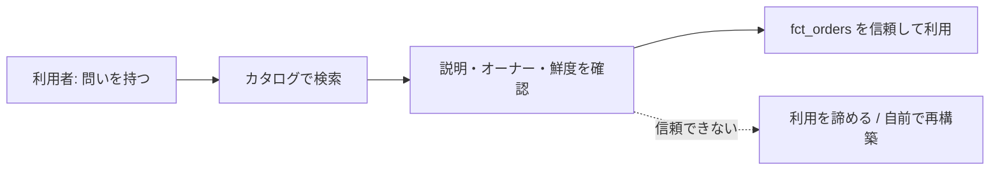

# 発見可能性 — 「作ったけど使われない」への処方

苦労して作ったテーブルが、誰にも使われずに静かに腐っていく。これは失敗モード1「作ったけど使われない（unused）」の典型です。原因の多くは「データの品質」ではなく「見つけてもらえないこと」にあります。このレッスンは、データを発見可能（discoverable）にするための処方箋です。

## 直感をつかむ：図書館に背表紙がない本

世界一正確なデータマートを作っても、それが「どこにあるか」「何を意味するか」「信用していいか」が分からなければ、利用者にとっては存在しないのと同じです。背表紙のない本が並ぶ図書館を想像してください。中身がどれだけ良くても、誰も手に取れません。発見可能性とは、その背表紙とインデックスを整える仕事です。

:::insight
データは「作った瞬間」ではなく「誰かに見つけられ、信用され、使われた瞬間」に初めて価値を生む。発見可能性は付加機能ではなく、利用の前提条件である。
:::

## 正確な定義

**発見可能性（discoverability）** とは、利用者が「自分の問いに答えるデータ資産」を、最小の労力で探し当て、内容を理解し、信用できる状態を指します。これを支える要素は4つです。

- **メタデータ**：データ自身を説明するデータ。テーブルの説明、カラムの意味、更新頻度、オーナー、鮮度。
- **命名規約**：名前だけで役割と粒度が推測できる一貫したルール。
- **データカタログ**：上記を一覧・検索できる場所。社内の「データの図書館」。
- **信頼の手がかり**：いつ更新されたか、誰が責任者か、品質チェックは通っているか。

## 命名規約：名前は最小のドキュメント

名前は、利用者が最初に出会うメタデータです。共通スキーマの mart は、接頭辞で役割が一目で分かります。

| 接頭辞 | 意味 | 例 |
|--------|------|-----|
| `fct_` | ファクト（出来事・数値） | `fct_orders` |
| `dim_` | ディメンション（文脈・属性） | `dim_customer`, `dim_product`, `dim_date` |
| `stg_` | ステージング（中間整形） | `stg_orders` |

接尾辞のキー命名も統一します。サロゲートキーは `_key`（`customer_key`）、ソース由来の業務IDは `_id`（`customer_id`）。この一貫性があれば、SQLを書く前に結合の仕方が読めます。

```sql
-- 名前から粒度と結合が即座に読める
select
  c.country,
  count(*) as order_count
from fct_orders f
join dim_customer c on f.customer_key = c.customer_key
where f.status = 'completed'
group by c.country;
```

:::tip
良い名前のテストは「ドキュメントを開かずに、テーブル名とカラム名だけで何が入っているか説明できるか」。説明できないなら、名前かカラム設計を見直す。
:::

## メタデータとオーナー：信頼の手がかりを埋め込む

カタログに載せるべき最小限のメタデータは「説明・オーナー・鮮度」です。dbt なら schema.yml に、BigQuery ならテーブル/カラムの description に書きます。コードとメタデータを同じ場所に置くと、腐りにくくなります。

```yaml
models:
  - name: fct_orders
    description: "注文単位のファクト。1行=1注文。金額は確定注文のみ status='completed' で集計対象。"
    meta:
      owner: "data-platform-team"
      freshness: "daily 06:00 JST"
    columns:
      - name: amount
        description: "注文合計金額（円, 税込, 確定時点）。キャンセルは含まない。"
```

オーナーが明記されていれば、利用者は「これは誰に聞けばいいか」が分かり、放置データではないと安心できます。**オーナー不在のデータは、信用されず使われない。**

## データカタログ：探せる場所を一つにする

カタログは、検索・説明・系譜（リネージ）・利用統計を集約する「データの入口」です。利用者は「customers」と検索して `dim_customer` にたどり着き、説明・オーナー・最終更新を確認し、安心して使い始められます。



点線の分岐が、まさに失敗モード1が起きる瞬間です。情報が足りないと、利用者は諦めるか、似たテーブルを勝手に作り（サイロ化・失敗モード2の種）、組織のデータは二重化していきます。

## 利用者起点で作る、そしてローンチする

発見可能性は「作った後」の話に見えて、実は「作る前」から始まります。

- **利用者起点**：「このデータで誰が、どんな問いに答えるか」を先に定義する。問いのない（need のない）テーブルは、メタデータを完璧にしても使われない。
- **ローンチと宣伝**：完成したら能動的に告知する。Slack で「`fct_orders` を公開しました。国別売上はこのクエリで出せます」と例付きで共有するだけで、利用率は大きく変わる。データは「黙って置く」のではなく「お披露目する」もの。

:::antipattern
「とりあえず全テーブルをカタログに登録すれば発見可能になる」。説明もオーナーも例もない数千テーブルの一覧は、検索ノイズを増やすだけで、かえって何も見つからなくなる。量より、利用者の問いに答える資産の質。
:::

## よくあるアンチパターン

- **暗号のような名前**：`tbl_001`, `temp_final_v2`。名前が何も語らず、開くまで中身が不明。
- **説明欄が空**：description が全カラム空白。書いた本人しか意味が分からず、半年後には本人も忘れる。
- **オーナー不明**：壊れても誰が直すか分からず、利用者は「いつ消えるか分からないもの」として避ける。
- **作りっぱなし**：公開告知も使い方の例もなく、存在自体が知られない。

### 腐らせないポイント

失敗モード1「作ったけど使われない（unused）」への直接の処方です。

- **発見可能性は利用の前提**：見つからない・意味が分からない・信用できないデータは、品質が高くても使われない。
- **名前を最小のドキュメントにする**：`fct_`/`dim_`、`_key`/`_id` の一貫した規約で、開く前に役割と粒度を伝える。
- **説明・オーナー・鮮度を必ず添える**：信頼の手がかりがないデータは、放置物として避けられる。
- **利用者起点で作り、ローンチで宣伝する**：問いから逆算して作り、完成したら例付きで能動的に告知する。

## 演習

問1：共通スキーマの `dim_product` に description を付けるとして、テーブルと `category` カラムに書くべき説明文を、利用者が安心して使えるよう1〜2文で書いてみよう。

問2：利用者が「国別の確定注文数を知りたい」とき、カタログで `dim_customer` と `fct_orders` を見つけた前提で、その問いに答えるSQLを書いてみよう。

解答例（問1）：
- テーブル：「商品マスタのディメンション。1行=1商品。`product_key` がサロゲートキー、`product_id` がソースの業務ID。」
- `category` カラム：「商品カテゴリ名。プロダクト側のマスタ定義に準拠。未分類は NULL。」

解答例（問2）：

```sql
select
  c.country,
  count(*) as completed_order_count
from fct_orders f
join dim_customer c on f.customer_key = c.customer_key
where f.status = 'completed'
group by c.country
order by completed_order_count desc;
```

## まとめ

- データは「作った瞬間」ではなく「見つけられ・理解され・信用され・使われた瞬間」に価値を生む。
- 命名規約は最小のドキュメント。`fct_`/`dim_`、`_key`/`_id` の一貫性が、開く前に意味を伝える。
- 説明・オーナー・鮮度の3点メタデータが、信頼の手がかりになる。信頼は利用の前提。
- データカタログは「探せる入口」。情報不足は諦めと再構築（サイロ化）を招く。
- 発見可能性は作る前から始まる。利用者起点で作り、ローンチで能動的に宣伝する。
