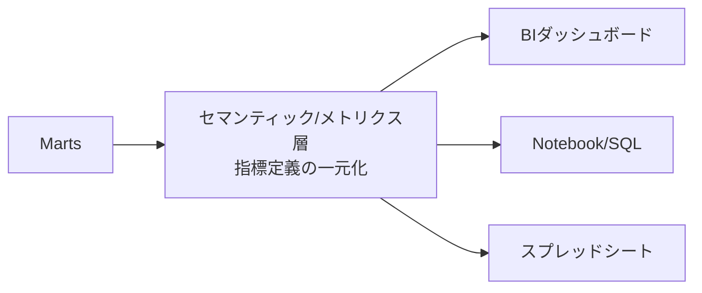

# セルフサーブと民主化 — 「価値がチームに閉じる」への処方

あるアナリストが渾身のダッシュボードを作った。社内で評判になり、問い合わせが殺到する。「先月の売上の定義を教えて」「この数字、自分のレポートでも出したい」「フィルタを変えてくれ」。気づけば彼は一日中、他人のデータ依頼をさばく "人間API" になっていた。彼が休むと分析が止まる。これが失敗モード2、**価値がチームに閉じる（siloed）** の典型的な姿だ。

データの価値は使われて初めて生まれる。だが、その価値が特定の人やチームの頭の中・手元のSQLに閉じ込められると、組織全体には広がらない。処方箋は「**セルフサーブ（self-serve）**」、つまり利用者が自分で安全に答えにたどり着ける状態を作ることだ。

## 正確な定義

- **セルフサーブ分析**: データチームに依頼しなくても、利用者が自分でデータを探し・理解し・使える状態。
- **データの民主化（democratization）**: 一部の専門家だけでなく、権限と知識を持つ広い範囲の人がデータを活用できるようにすること。
- **セマンティック層 / メトリクス層（semantic / metrics layer）**: 「売上」「アクティブ顧客」といった**ビジネス指標の定義を一箇所に集約**し、誰がどのツールから参照しても同じ計算結果になるようにする中間層。

民主化はただ全員にアクセス権を配ることではない。鍵を配るだけでは、各自が勝手な定義で違う数字を出す混乱（後述）を生む。**正しい定義への入口を整え、属人性を解く**ことが本質だ。



## 具体例：指標定義を一元化する

「売上」を各自が自由にSQLで書くと、ある人は `status` を無視し、ある人はキャンセルを含めてしまう。そこで**正本となる定義**を一つ決め、ビューやメトリクス層に固定する。

```sql
-- メトリクス「月次売上（確定分）」の正本定義
-- 完了注文のみ・明細金額の合計、という定義をここに固定する
CREATE VIEW metric_monthly_revenue AS
SELECT
  d.year,
  d.month,
  SUM(f.amount) AS revenue
FROM fct_orders AS f
JOIN dim_date AS d ON f.order_date_key = d.date_key
WHERE f.status = 'completed'   -- 「売上」はキャンセル・保留を含めない、と定義
GROUP BY d.year, d.month;
```

利用者はこの集計ロジックを知らなくても `SELECT * FROM metric_monthly_revenue` で常に同じ「売上」を得られる。定義が変わってもビューを直すだけで、全利用者に一斉に反映される。これが**属人性の解消**だ。指標が個人のSQLではなく、共有された資産として存在する。

:::tip
セルフサーブの第一歩は「よく聞かれる質問」を特定し、それを答える指標・ビューを用意すること。問い合わせログは、作るべきセルフサーブ資産のリストそのものだ。
:::

## セルフサーブを支える3本柱

| 柱 | 内容 | siloed を防ぐ理由 |
|----|------|------------------|
| 指標定義の一元化 | セマンティック/メトリクス層に正本を置く | 誰が引いても同じ数字。定義が人に依存しない |
| 権限設計 | 役割ベースで「見てよい範囲」を明確化 | 安全に開放できるから鍵を抱え込まずに済む |
| ドキュメント | 各テーブル・指標の意味・更新頻度を記述 | 質問に人を介さず答えられる |

権限は「全公開か非公開か」の二択ではない。`dim_customer` の氏名・国などPIIは限定公開、集計済みの `metric_monthly_revenue` は広く公開、というように**粒度を分けて開く**ことで、安全さとセルフサーブを両立できる。

## よくあるアンチパターン

:::antipattern 指標定義の散在
同じ「アクティブ顧客」が、BIには「過去30日に購入」、別レポートには「過去30日に何らかのイベント」として定義され、数字が食い違う。会議は「どっちが正しいのか」論争に消える。一元化された定義が無いと、民主化は "混乱の民主化" になる。
:::

:::antipattern 英雄依存（hero dependency）
特定の一人だけが全クエリとデータの所在を把握している状態。本人の不在で分析が止まり、知識が引き継がれない。属人性は組織にとってリスクであって、美徳ではない。
:::

:::warning
「とりあえず全テーブルに全員アクセス可」は民主化ではない。ドキュメントと正本定義が無いまま生テーブルを開放すると、`orders` を `status` 無視で集計するような**誤用（失敗モード3）**を量産する。開放と定義の整備はセットで進める。
:::

## 腐らせないポイント

価値がチームに閉じる（siloed）への直接の処方は、**知識を人から資産へ移す**ことに尽きる。

- 指標は個人のSQLではなく、セマンティック/メトリクス層の**正本定義**として共有資産化する。
- ドキュメントで「この指標は何か・いつ更新されるか」を人を介さず分かるようにする。
- 権限は粒度を分けて開き、安全なセルフサーブを可能にする。

これらにより、アナリストは "人間API" から解放され、利用者は自分で答えにたどり着ける。データの価値がチームの壁を越えて組織全体に広がる。

## 演習

次の状況を考えよ。マーケ担当が「今月アクティブな顧客数を知りたい」と毎回データチームに依頼している。属人性を解消するため、「アクティブ顧客 = 当月に1回以上 `purchase` イベントを起こした顧客」という定義で、月次のアクティブ顧客数を返す正本ビュー `metric_monthly_active_customers` を作成せよ。

解答例:

```sql
CREATE VIEW metric_monthly_active_customers AS
SELECT
  d.year,
  d.month,
  COUNT(DISTINCT e.customer_id) AS active_customers
FROM events AS e
JOIN dim_date AS d ON CAST(e.event_time AS DATE) = d.date
WHERE e.event_type = 'purchase'   -- 「アクティブ」の定義をここに固定
GROUP BY d.year, d.month;
```

このビューを共有すれば、マーケ担当は依頼せず自分で `SELECT * FROM metric_monthly_active_customers` を実行でき、しかも全社で同じ「アクティブ顧客」を指せる。

## まとめ

- 失敗モード2「価値がチームに閉じる」の根本原因は、知識と指標が人の手元に閉じ込められる属人性にある。
- 処方はセルフサーブ。利用者がデータチームを介さず安全に答えへたどり着ける状態を作る。
- セマンティック/メトリクス層で指標定義を一元化し、正本を共有資産にする。
- 権限は粒度を分けて開き、ドキュメントで人を介さず意味が分かるようにする。
- 開放と定義整備はセット。定義無き全開放は混乱と誤用を招く。
