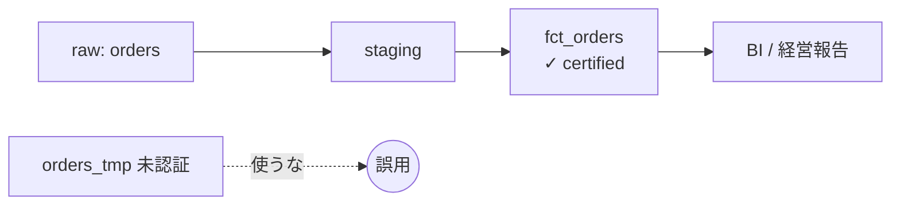

# ガバナンスと契約 — 「想定外の使い方」への処方

データ基盤を作って、人に使ってもらえた。ここまで来たら成功——とは限らない。次の落とし穴は「使ってもらえるが、想定とは違う使われ方をされる」ことだ。集計途中の中間テーブルを、誰かが正式な売上として経営報告に使う。`amount` が税抜なのに税込だと思って請求書に転記される。テスト用のダミー顧客が分析対象に混ざる。どれも、データそのものは正しいのに「意味のすり合わせ」が欠けたために起きる事故だ。これが失敗モード3「想定外の使い方をされる（misused）」である。

:::insight
データの誤用は、データが間違っているから起きるのではない。「このデータは何を表し、どう使ってよいか」という前提が、作り手の頭の中にしかないから起きる。前提を作り手の外に出すことが、ガバナンスの本質だ。
:::

## ガバナンスとは「文脈の明文化」

ガバナンス（governance）と聞くと、官僚的な承認フローや禁止事項の羅列を思い浮かべるかもしれない。だがデータ基盤におけるガバナンスの中心はもっと素朴だ。「このデータの意味・粒度・想定用途・品質保証のレベルを、利用者が見える形で書き残す」こと。利用者が誤解しようがない状態を作れば、誤用は構造的に減る。

明文化すべきことは、最低限この4点に集約できる。

| 項目 | 問い | 例 |
|---|---|---|
| 定義 | この列は何を意味するか | `amount` = 明細単価×数量の合計（税抜・JPY） |
| 粒度 | 1行は何を表すか | 1行 = 1注文（`fct_orders` は注文粒度） |
| 想定用途 | 何に使ってよいか | 売上集計に使用可。リアルタイム在庫には不可 |
| 品質保証 | どこまで信頼できるか | 毎朝7時更新・欠損なし・確定値のみ |

## データ契約（Data Contract）

定義を「文章」ではなく「機械が検証できる約束」にしたものがデータ契約だ。提供側（producer）と利用側（consumer）の間で、スキーマ・型・制約・更新頻度を取り決め、違反したらパイプラインを止める。口約束ではなくコードで縛るのがポイントだ。

```yaml
# fct_orders のデータ契約（抜粋）
model: fct_orders
grain: order_id        # 1行 = 1注文。明細粒度ではない
owner: data-platform-team
freshness:
  updated_by: "07:00 JST"   # SLA: 毎朝7時までに当日確定
columns:
  - name: order_id
    type: string
    tests: [not_null, unique]
  - name: amount
    type: numeric
    description: "税抜・JPY。order_items の単価×数量の合計"
    tests: [not_null, non_negative]
  - name: status
    type: string
    accepted_values: ['completed', 'cancelled', 'pending']
```

この契約があれば、たとえば `status` に未知の値が混ざった瞬間にテストが落ち、誤ったデータが下流へ流れる前に止まる。`grain: order_id` という1行が、「これは明細ではなく注文単位だ」という誤解を未然に防ぐ。

:::tip
SLA（Service Level Agreement）は「いつまでに・どの鮮度で・どの品質で提供するか」の約束。「毎朝7時までに前日分が確定」と書いておけば、利用者は朝6時のデータが未確定だと知った上で使える。鮮度の約束がないデータは、いつでも壊れていてよいデータと同じだ。
:::

## アクセス制御とPII

誰でも全部見られる状態は、便利に見えて危うい。特に個人情報（PII: Personally Identifiable Information）——氏名・メールアドレス・国——は、漏洩すれば法的責任に直結する。最小権限の原則（必要な人に必要な範囲だけ）で守る。

```sql
-- 分析者には PII を伏せた個人情報マスク済みビューだけを公開する
create view dim_customer_masked as
select
  customer_key,
  customer_id,
  country,                          -- 集計に必要な属性は残す
  'REDACTED'        as name,        -- 氏名はマスク
  date_trunc('month', signup_date) as signup_month  -- 日付は月へ粗くする
from dim_customer;
```

生の `dim_customer` はデータ基盤チームだけがアクセスでき、一般の分析者はこのマスクビュー越しにしか触れない。こうした制御は、コンプライアンス（GDPR・個人情報保護法など）の要請でもある。

## 認証済みデータセット

利用者からすると、社内には似たテーブルが無数にある。`fct_orders` `orders_tmp` `orders_v2_test`——どれが正なのか分からないとき、人は手近なものを使ってしまう。そこで「これは公式に保証された正本だ」と旗を立てるのが認証済み（certified）データセットの考え方だ。BIツールやデータカタログ上で認証バッジを付け、オーナーと契約を明示する。



認証は「品質が高い」という主張ではなく、「契約とオーナーが存在し、壊れたら責任を持って直す人がいる」という宣言だ。だから認証済みデータセットには必ずオーナーシップが伴う。

## よくあるアンチパターン

:::antipattern
中間テーブルや個人の作業用テーブルに、本番と区別のつかない名前を付けて全員に公開する。利用者は「あるなら使ってよい」と解釈する。命名・認証・アクセス制御のいずれも欠けると、未保証のデータが正本として独り歩きする。
:::

:::warning
定義をNotionやスプレッドシートに書いて満足する。ドキュメントとデータが乖離し、半年後には「書いてあることと実際の値が違う」状態になる。定義は契約としてコードに埋め込み、テストで強制してこそ守られる。
:::

## 演習

`fct_orders` を「正式な売上集計用」として安全に使うため、契約違反を検知するテストを書きたい。`status` が想定外の値、または `amount` が負の行を検出するクエリを書け（1行でも返れば契約違反）。

```sql
-- 解答例
select order_id, status, amount
from fct_orders
where status not in ('completed', 'cancelled', 'pending')
   or amount < 0;
```

このクエリが0行を返すことを毎朝のパイプラインで確認すれば、未知のステータスや異常値が下流に流れる前に止められる。

### 腐らせないポイント

失敗モード3「想定外の使い方をされる（misused）」への処方は、作り手の頭の中にある前提を外に出すことに尽きる。

- **定義・粒度・想定用途を明文化する**: 1行が何を表し、何に使ってよいかを書く。
- **データ契約とSLAで縛る**: 文章ではなくコードとテストで約束を強制する。
- **アクセス制御とPII保護**: 最小権限とマスクで、見せてよい人に見せてよい範囲だけ。
- **認証済みデータセット**: 正本に旗を立て、オーナーと契約を結びつける。

## まとめ

- 誤用はデータの誤りではなく「前提の不在」から生まれる。前提の明文化がガバナンスの核心。
- 定義・粒度・想定用途・品質保証の4点を書き残せば、利用者は誤解しようがなくなる。
- データ契約はスキーマ・型・制約・鮮度をコードで縛り、違反を自動で止める仕組み。SLAで鮮度と品質を約束する。
- PIIは最小権限とマスクビューで守り、コンプライアンス要請に応える。
- 認証済みデータセットは「契約とオーナーがいる正本」の宣言。旗を立てて誤用を構造的に防ぐ。
