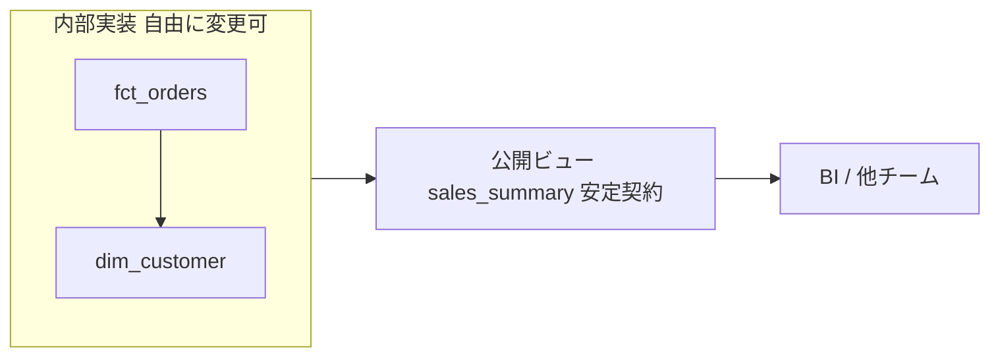

# バージョニングと廃止 — 「使われすぎて変更できない」への処方

良いデータ基盤を作ると、皮肉なことに別の問題が生まれる。便利すぎて、みんなが使い、誰も触れなくなるのだ。これが4つ目の失敗モード「使われすぎて変更できない（ossified＝硬直化）」である。本レッスンはその処方箋を扱う。

## 直感：壁の裏の配線

家の壁にあるコンセントを思い出してほしい。あなたはプラグを差すだけで電気が使える。壁の裏で配線がどう走っているか、発電所が変わったか、誰も気にしない。コンセントという**安定したインターフェース**が、内部の変更を吸収しているからだ。

データ基盤も同じだ。利用者に見せる「差込口」を固定し、その裏の実装は自由に作り替えられる状態を保つ。これが硬直化を防ぐ核心である。

:::insight
硬直化は「使われている」ことの裏返しであり、成功の証でもある。問題は使われ方ではなく、**内部実装が直接むき出しになっている**ことにある。
:::

## 定義：安定インターフェースと公開境界

- **公開ビュー（安定インターフェース）**: 利用者が直接参照してよい唯一の窓口。列名・型・意味・粒度を「契約」として固定する。
- **内部実装**: 公開ビューが裏で参照する物理テーブルや中間モデル。利用者には見せず、自由に変更できる。
- **バージョニング**: 互換性を壊す変更が必要なとき、古い窓口を残したまま新しい窓口を**並べて**提供すること。
- **廃止（deprecation）**: 古い窓口を「いつ・どう閉じるか」を予告してから閉じる、計画的な撤去プロセス。



## 具体例：公開ビューで実装を隠す

利用者には物理テーブル `fct_orders` を直接触らせず、公開ビューを差込口として提供する。

```sql
-- 公開インターフェース。利用者はこれだけを参照する
CREATE VIEW sales_summary AS
SELECT
  o.order_id,
  c.country,
  o.order_date,
  o.amount
FROM fct_orders AS o
JOIN dim_customer AS c ON o.customer_key = c.customer_key
WHERE o.status = 'completed';
```

後日、内部で `fct_orders` を再構築したり結合方法を変えても、`sales_summary` の列と意味さえ保てば、利用者のクエリは一切壊れない。壁の裏の配線を引き直しても、コンセントの形は変わらないのと同じだ。

### 破壊的変更が必要になったら：並行バージョニング

「金額を税抜きから税込みに変える」のように意味が変わる変更は、既存利用者を黙って壊す。そこで新旧を並べる。

```sql
-- 既存（当面は維持し、廃止予告をつける）
CREATE VIEW sales_summary AS ...;        -- amount = 税抜き

-- 新インターフェース。意味の変更はバージョンで明示
CREATE VIEW sales_summary_v2 AS
SELECT order_id, country, order_date,
       amount        AS amount_excl_tax,
       amount * 1.10 AS amount_incl_tax
FROM fct_orders WHERE status = 'completed';
```

利用者は自分のペースで `v2` へ移行できる。これが疎結合の実体だ。

:::warning
バージョンを無限に増やしてはいけない。`_v2`, `_v3`, `_v4`… と放置すると、今度はバージョンの森が硬直化する。新バージョンを出すなら、必ず**旧バージョンの廃止予定をセットで決める**。
:::

## 廃止（deprecation）プロセス

廃止とは「予告 → 移行期間 → 撤去」の3段階。抜き打ちで消さないことが信頼の鍵だ。

| 段階 | やること | 目安 |
|------|----------|------|
| 予告 | 廃止対象・代替・期限を告知。メタデータに `deprecated` を記録 | 即時 |
| 移行期間 | 利用ログを監視し、残った利用者に個別連絡 | 1〜3か月 |
| 撤去 | 利用ゼロを確認してから削除 | 期限後 |

```sql
-- 廃止予告はコメントで明示し、カタログ/ドキュメントにも反映
COMMENT ON VIEW sales_summary IS
  'DEPRECATED: 2026-09-30 廃止予定。sales_summary_v2 へ移行してください。';
```

撤去の前に「本当に誰も使っていないか」をクエリログ（情報スキーマや監査ログ）で確認する。これを怠ると、四半期締めの夜に誰かのレポートが静かに壊れる。

:::antipattern
**サイレント変更**: 予告なく列を消す・意味を変える。**孤児ビューの放置**: 廃止予定とだけ書いて何年も消さず、結局それも依存される。**オーナー不在**: 「誰が直すのか」が曖昧なまま公開し、壊れても放置される。
:::

## オーナーシップを明確にする

安定インターフェースは「契約」だから、契約の責任者が要る。各公開ビューに**オーナー（人/チーム）・SLA・変更窓口**を紐づける。オーナーがいないインターフェースは、誰も変更を判断できず、結果として誰も触れない＝硬直化する。

## 腐らせないポイント

このレッスンは失敗モード4「使われすぎて変更できない（ossified）」への直接の処方である。

- **安定インターフェースで内部を隠す**: 利用者には公開ビューだけを見せ、物理実装は自由に作り替えられる状態を保つ（疎結合）。
- **破壊的変更はバージョンを並走させる**: 黙って壊さず、新旧を並べて利用者に移行の猶予を与える。
- **廃止は予告つきプロセスで**: 予告→移行→撤去。利用ログで利用ゼロを確認してから消す。
- **オーナーシップを明示**: 各インターフェースに責任者とSLAを紐づけ、「変更できる状態」を維持する。

## 演習

問1. `order_items` を集計した公開ビュー `order_item_detail` を作りたい。利用者が物理テーブルを直接触らずに済むよう、注文明細粒度（1行＝1明細）で `order_item_id, order_id, product_id, quantity, line_amount`（line_amount = quantity * unit_price）を返すビューを書け。

問2. 問1のビューについて、`line_amount` の定義を「割引適用後」に変えたい（意味が変わる破壊的変更）。既存利用者を壊さない方法を、SQLの方針とともに述べよ。

### 解答例

問1:

```sql
CREATE VIEW order_item_detail AS
SELECT
  order_item_id,
  order_id,
  product_id,
  quantity,
  quantity * unit_price AS line_amount
FROM order_items;
```

問2: 既存の `order_item_detail` はそのまま残し、新定義は `order_item_detail_v2` として並行提供する。`v2` には割引適用後の `line_amount` を入れ、旧ビューにはコメント等で廃止予定日と移行先を明示する。移行期間中に利用ログを監視し、旧ビューの利用がゼロになったことを確認してから撤去する。こうすれば意味の変更が利用者を黙って壊すことを避けられる。

## まとめ

- 硬直化は成功の副作用。原因は使われ方ではなく、**内部実装がむき出し**なこと。
- **公開ビュー**を安定インターフェースにし、裏の実装は自由に変更できる状態を保つ（疎結合）。
- 意味を変える破壊的変更は、**新旧バージョンを並走**させて移行猶予を与える。
- 廃止は「**予告→移行→撤去**」の計画プロセスで行い、利用ゼロを確認してから消す。
- 各インターフェースに**オーナーとSLA**を紐づけ、変更を判断できる状態を維持する。
