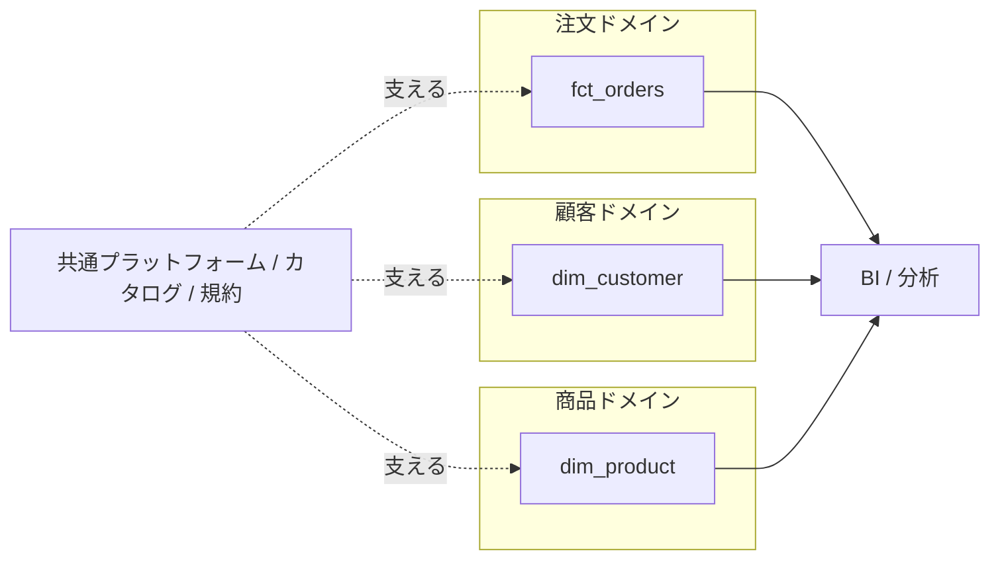

# データプロダクトとデータメッシュ — 統合の視点

これまでのレッスンで、データ基盤が「腐る」4つの失敗モード — 使われない・サイロ化する・誤用される・硬直化する — と、それぞれの処方箋を見てきた。このレッスンはそれらを一段高い視点でまとめ直す。バラバラの対策を一本の背骨に通すための考え方が「データプロダクト」と「データメッシュ」だ。

## 直感をつかむ — テーブルを「製品」として扱う

ふつう、データ基盤のテーブルは「作業の副産物」として生まれる。誰かが必要に迫ってクエリを書き、中間テーブルを置き、いつの間にか他人も参照し始める。オーナーは曖昧で、ドキュメントはなく、変更すると誰かが壊れる。これが腐る基盤の典型像だ。

ここで発想を反転させる。テーブルやデータセットを、社内に対して提供する一つの「製品（プロダクト）」だと考える。製品には作り手（オーナー）がいて、利用者がいて、品質保証があり、使い方の説明書がある。アプリのAPIを世に出すときと同じ規律を、データにも当てはめる。これがデータプロダクトの中核だ。

:::insight
4つの失敗モードへの処方は、別々のテクニックではなく「データを製品として扱う」という一つの態度から自然に導かれる。
:::

## 正確な定義 — データプロダクトの6性質

データプロダクトとは、利用者に価値を届けることを目的に設計・運用される、自己完結したデータの単位だ。良いデータプロダクトは次の6つの性質を満たす。各性質が、どの失敗モードを防ぐかに注目してほしい。

| 性質 | 意味 | 主に防ぐ失敗モード |
|------|------|------------------|
| 発見可能 (discoverable) | カタログ等で検索でき、存在に気づける | 使われない (unused) |
| アドレス可能 (addressable) | 安定した名前・場所で一意に参照できる | 使われない / 硬直化 |
| 信頼できる (trustworthy) | 鮮度・正確性・SLAが保証されている | 使われない / 誤用 |
| 自己記述的 (self-describing) | スキーマ・意味・粒度が付属文書で分かる | サイロ化 / 誤用 |
| 相互運用可能 (interoperable) | 共通のキー・規約で他プロダクトと結合できる | サイロ化 |
| 安全 (secure) | アクセス制御・ガバナンスが組み込まれている | 誤用 |

「アドレス可能」とは、引っ越ししない住所を持つこと。`marts.dim_customer` のような安定したパスで常に同じものを指せる状態を言う。「相互運用可能」とは、各プロダクトが勝手な顧客IDを使うのではなく、共通の `customer_key` で素直に結合できることを指す。

## 具体例 — 製品としての dim_customer

「顧客マスタ」を単なるテーブルではなくデータプロダクトとして公開するなら、最低限こうした輪郭を与える。

```sql
-- 顧客ディメンション（データプロダクト: customer）
-- オーナー: CRMチーム / SLA: 毎日 06:00 JST までに前日分反映 / 鮮度: 1日
-- 粒度: 1行 = 1顧客 / 主キー: customer_key（相互運用のための共通キー）
SELECT
  customer_key,      -- 結合用の安定キー（addressable / interoperable）
  customer_id,       -- ソース系の自然キー
  name,
  country,
  signup_date
FROM marts.dim_customer;
```

このSQL自体は平凡だ。重要なのは周囲の約束 — オーナー、SLA、粒度、キーの意味 — を明文化し、カタログに載せ、変更時にバージョンを切ることである。コードと約束がセットになって初めて「製品」になる。

## データメッシュ — 所有を中央からドメインへ

データプロダクトが「単位」の話なら、データメッシュは「組織」の話だ。中央のデータチーム一つに全テーブルを集中させると、リクエストが詰まり、現場の文脈が失われ、サイロと硬直化が同時に進む。

データメッシュは発想を変える。「注文」「顧客」「商品」といったビジネスドメインごとに、そのデータを最もよく知るチームがデータプロダクトを所有・運用する。中央チームは個々のテーブルを作る人ではなく、共通の規約・カタログ・プラットフォームを整える「土台の提供者」に回る。



ドメインが所有することで、誰に聞けばいいか（オーナーシップ）が明確になり、変更の責任所在もはっきりする。これが硬直化とサイロ化への構造的な処方になる。

:::tip
データメッシュは「組織体制」と「規約」の話であって、特定の製品やツールではない。まず決めるべきは「このドメインのオーナーは誰か」であり、技術選定はその後でよい。
:::

## よくあるアンチパターン — 過剰適用

これらの概念は強力だが、小さな組織や少数のテーブルに丸ごと適用すると、得られる価値より管理コストが上回る。

:::antipattern
データセットが10個、利用者が同じ部署内、という規模でドメイン分割・連邦ガバナンス・厳格なプロダクト登録フローを敷くと、手続きばかり増えて誰も動けなくなる。「腐る」を防ぐはずが、別種の硬直化を生む。
:::

ラベルを貼ること自体が目的化する罠もある。テーブル名に "data product" と付けても、オーナーもSLAもドキュメントもなければただの飾りだ。順序は逆で、「発見可能・信頼できる・自己記述的」といった性質を一つずつ満たしていった結果が、たまたまデータプロダクトと呼べるものになる。

:::warning
新しい用語を導入する前に問うべきは「いま一番腐りかけている場所はどこか」。最も痛い失敗モードに、6性質のうち1〜2個を当てるところから始める。全部を一度に入れない。
:::

## 演習

`dim_product` を「商品ドメインが所有するデータプロダクト」として公開すると仮定する。6性質のうち「自己記述的」を満たすため、各列に意味・粒度・キーの役割を示すコメント付きの公開用SELECTを書け。

解答例:

```sql
-- 商品ディメンション（データプロダクト: product）
-- オーナー: 商品ドメインチーム / 粒度: 1行 = 1商品 / SLA: 毎日 07:00 JST 反映
SELECT
  product_key,   -- 結合用の安定キー（addressable / interoperable）
  product_id,    -- ソース系の自然キー（products.product_id 由来）
  name,          -- 表示用の商品名
  category,      -- 分類。集計の主要な切り口
  price          -- 定価。実売単価は order_items.unit_price を使うこと（誤用防止）
FROM marts.dim_product;
```

`price` への注記のように、「この列を何に使い、何に使わないか」まで書くと、誤用モードを直接ふさげる。

## まとめ

- データプロダクトとは、テーブルを副産物ではなく「製品」として扱う態度であり、6性質（発見可能・アドレス可能・信頼できる・自己記述的・相互運用可能・安全）で具体化される。
- 6性質は4つの失敗モードへの処方を一本に束ねる背骨であり、別々のテクニックの寄せ集めではない。
- データメッシュは所有を中央からビジネスドメインへ移し、中央は共通基盤と規約の提供者に回る組織論である。
- ドメイン所有はオーナーシップを明確化し、サイロ化と硬直化を構造的に防ぐ。
- これらは万能薬ではない。規模に合わせて、最も痛い失敗モードに必要な性質だけを段階的に適用する。
