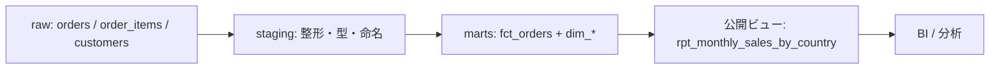

# キャップストーン — 腐らないデータマートを設計する

このコースで学んだ道具を、ここで一本につなげる。お題はシンプルだ。「国別の月次売上を、誰でも安心して使える形で出したい」。この一言を、要件 → 粒度宣言 → staging → スター設計 → テスト → 契約 → 公開ビュー → 廃止計画、という一直線の流れで設計しきる。途中の各段で、4つの失敗モード（unused / siloed / misused / ossified）のどれを防いでいるのかを意識してほしい。

:::insight
データマートは「SQLを書くこと」ではなく「約束を設計すること」だ。誰が・どの粒度で・何を信じて使えるか。その約束が崩れない構造を組むのが本当の仕事。
:::

## 全体像



## ステップ1: 要件と粒度の宣言

最初にやることはSQLではない。「この指標は何の1行が何を意味するのか」を言葉で確定させることだ。これを飛ばすと misused が必ず起きる。

- 指標: 月次・国別の完了売上（`status = 'completed'` のみ）
- 売上の定義: `quantity * unit_price` の合計（注文明細ベース）
- 公開マートの粒度: **国 × 月 で1行**

粒度を宣言したら、それより細かい事実テーブル（fct）が要る。ここでは注文明細を事実の最小単位に選ぶ。

:::warning
「売上」を曖昧にしたまま進めると、キャンセル込みかどうか・税込みか・注文単位か明細単位かで人によって数字がズレる。定義は最初に文章で固定する。
:::

## ステップ2: staging で生データを整える

raw を直接マートで触らない。間に staging を挟み、型・命名・フィルタの責務をここへ集約する。

```sql
-- stg_order_items: 完了注文の明細だけを、意味の通る名前で整える
create or replace view stg_order_items as
select
  oi.order_item_id,
  oi.order_id,
  oi.product_id,
  o.customer_id,
  o.order_date,
  oi.quantity * oi.unit_price as line_amount
from order_items oi
join orders o on o.order_id = oi.order_id
where o.status = 'completed';
```

`line_amount` のような計算済みカラムを staging で1度だけ定義しておくと、下流が定義を再発明せずに済む（siloed 防止）。

## ステップ3: スター・スキーマを組む

事実（fct）と分類軸（dim）を分ける。fct は数字、dim は「誰の・何の」を持つ。

```sql
-- 事実: 注文明細の粒度（1行 = 1明細）
create or replace view fct_order_items as
select
  oi.order_item_id,
  oi.order_id,
  c.customer_key,
  d.date_key as order_date_key,
  oi.line_amount
from stg_order_items oi
join dim_customer c on c.customer_id = oi.customer_id
join dim_date d on d.date = oi.order_date;
```

dim_customer は国（country）を持つので、国別集計は dim 経由で行う。fct に国名を直書きしないのがポイント（dim を直せば全集計に反映され、ossified を避けられる）。

## ステップ4: テストで信頼を担保する

公開前に、最低限の健全性チェックを置く。失敗するクエリが0件を返すことを「合格」とする発想だ。

```sql
-- 1. 粒度の一意性: order_item_id は重複しないはず
select order_item_id, count(*) as cnt
from fct_order_items
group by order_item_id
having count(*) > 1;

-- 2. 参照整合性: 紐づく国が取れない行は無いはず
select f.order_item_id
from fct_order_items f
left join dim_customer c on c.customer_key = f.customer_key
where c.customer_key is null;
```

テストが通ること自体が「このマートは壊れていない」という発見可能性のシグナルになり、unused を防ぐ。

## ステップ5: 契約と公開ビュー

利用者が触るのは内部の fct/dim ではなく、**公開ビュー1枚**だ。これが安定インターフェースになる。

```sql
-- 公開: 国 × 月 の1行。粒度・定義はビュー名とコメントで宣言する
create or replace view rpt_monthly_sales_by_country as
select
  c.country,
  dt.year,
  dt.month,
  sum(f.line_amount) as sales_amount
from fct_order_items f
join dim_customer c on c.customer_key = f.customer_key
join dim_date dt on dt.date_key = f.order_date_key
group by c.country, dt.year, dt.month;
```

これがデータ契約だ。「列名・粒度・売上の定義は変えない。変えるときは予告する」という約束を、ビューとドキュメントで明文化する。利用者は内部構造を知らなくてよい（siloed 解消）。

:::tip
公開ビューに `rpt_`（report）の接頭辞を付けると「これは外向けの安定面」と一目で伝わる。内部の `stg_` / `fct_` / `dim_` と役割が名前で区別できる。
:::

## ステップ6: 変更と廃止の計画

契約は永遠ではない。だが「黙って消す・黙って変える」は最悪だ。変更には段取りを用意する。

- 破壊的変更は新バージョンを並走させる（例: `rpt_monthly_sales_by_country_v2`）
- 旧ビューは即削除せず、コメントで「廃止予定日・後継ビュー」を告知する
- 一定期間後、利用クエリのログを確認し、参照が消えたら撤去する

```sql
-- 廃止予告の例（コメントで意図と期限を残す）
-- DEPRECATED 2026-09-01: use rpt_monthly_sales_by_country_v2 (税抜→税込に定義変更)
create or replace view rpt_monthly_sales_by_country as
select * from rpt_monthly_sales_by_country_v2_compat;
```

予告と移行期間があれば、利用者は壊れずに乗り換えられる。これが ossified（使われすぎて変えられない）への唯一の現実的な対処だ。

### 腐らせないポイント

このキャップストーンは4モード全てを一気通貫で防ぐ設計になっている。

- **unused**: 命名規約・テスト・明確な指標定義で「見つかり、信頼できる」状態にした。
- **siloed**: staging で定義を1箇所に集約し、公開ビューで内部構造を隠して誰でも使える面を作った。
- **misused**: 最初に粒度と売上定義を文章で宣言し、契約として固定した。
- **ossified**: dim 経由の疎結合・バージョン並走・廃止予告で、変更可能性を残した。

## 演習

**問1**: 公開ビュー `rpt_monthly_sales_by_country` をベースに、「2026年の国別 年間売上」を月を畳んで集計するクエリを書け。

**問2**: ステップ4のテストに加え、「`sales_amount` が負になる行が無い」ことを検証するテストクエリを書け（0件なら合格）。

### 解答例

```sql
-- 問1: 月を畳んで年間集計
select country, year, sum(sales_amount) as annual_sales
from rpt_monthly_sales_by_country
where year = 2026
group by country, year
order by annual_sales desc;

-- 問2: 売上が負の行は存在しないはず（0件で合格）
select country, year, month, sales_amount
from rpt_monthly_sales_by_country
where sales_amount < 0;
```

## まとめ

- 設計は「要件 → 粒度宣言 → staging → スター → テスト → 契約 → 公開 → 廃止計画」の一直線で進める。
- 粒度と指標定義は、SQLより先に文章で固定する（misused 対策の起点）。
- 内部構造（stg/fct/dim）は隠し、利用者には公開ビュー1枚だけを安定インターフェースとして渡す。
- テストと命名規約は「信頼できる・見つかる」を作り、unused を防ぐ。
- 変更はバージョン並走と廃止予告で段取りし、契約を守りながら進化させる。
